**CSE6224 SOFTWARE REQUIREMENTS ENGINEERING**

**TRIMESTER 2510**

**SRS Document**

**TT6L**

**Campus Wellness Portal with Medical System and Fitness Center
Integration.**

| **Student Name**                       | **Student ID** |
|----------------------------------------|----------------|
| Tham Yong Shian                        | 1211108856     |
| Ahmad Farhan Zikri Bin Ahmad Fara      | 1171101842     |
| Mohamad Ammarul Azim Bin Mohamad Yusof | 1201100845     |                                               
| **Part 2**                                              |
| Lee Xiang Ze                           | 1211106818     |
| Yeoh Han Yi                            | 1211106319     |
| Ng Jin Mun                             | 241UC240BF     |
| Yu Ting Hui                            | 241UC240ZD     |

# **Table of contents**

[**Table of contents**](#table-of-contents) **2**

[**1.Introduction**](#introduction) **4**

> [1.1 Purpose](#purpose) 4
>
> [1.2 Scope](#scope) 5
>
> [1.3 Product Overview](#product-overview) 6
>
> [1.3.1 Product Perspective](#product-perspective) 6
>
> [1.3.2 Product Functions](#product-functions) 9
>
> [1.3.2.1 Student](#student) 10
>
> [1.3.2.2 Medical Staff](#medical-staff) 12
>
> [1.3.2.3 Fitness Coordinator](#fitness-coordinator) 14
>
> [1.3.2.4 System Admin](#system-admin) 16
>
> [1.3.2.5 Fitness Software System](#fitness-software-system) 18
>
> [1.3.2.6 Medical Software System](#medical-software-system) 20
>
> [1.3.3 User characteristics](#user-characteristics) 22
>
> [1.3.4 Limitations](#limitations) 23
>
> [1.4 Definitions](#definitions) 24

[**2. References**](#references) **25**

[**3. Requirements**](#requirements) **26**

> [3.1 Functions](#functions) 26
>
> [3.1.1 Sequence Diagram](#sequence-diagram) 27
>
> [3.1.1.1 Login (All Users)](#login-all-users) 27
>
> [3.1.1.2 Register (All Users except System
> Admin)](#register-all-users-except-system-admin) 28
>
> [3.1.1.3 Schedule Appointment
> (Student)](#schedule-appointment-student) 29
>
> [3.1.1.4 Book Fitness Class (Student)](#book-fitness-class-student) 31
>
> [3.1.1.5 Set Goal (Student)](#set-goal-student) 33
>
> [3.1.1.6 View Timetable (Student)](#view-timetable-student) 35
>
> [3.1.1.7 Watch Content (Student)](#watch-content-student) 37
>
> [3.1.1.8 View Health Advice (Student)](#view-health-advice-student) 38
>
> [3.1.1.9 Access Online Chat (Student & Medical
> Staff)](#access-online-chat-student-medical-staff) 40
>
> [3.1.1.10 Submit Feedback (Student)](#submit-feedback-student) 42
>
> [3.1.1.11 Manage Appointment (Medical
> Staff)](#manage-appointment-medical-staff) 43
>
> [3.1.1.12 Update Medical Record (Medical
> Staff)](#update-medical-record-medical-staff) 45
>
> [3.1.1.13 Send Health Advice (Medical
> Staff)](#send-health-advice-medical-staff) 47
>
> [3.1.1.14 Monitor Student Progress (Medical
> Staff)](#monitor-student-progress-medical-staff) 48
>
> [3.1.1.15 Post Media (Medical Staff & Fitness
> Coordinator)](#post-media-medical-staff-fitness-coordinator) 50
>
> [3.1.1.16 Assign Fitness Class (Fitness
> Coordinator)](#assign-fitness-class-fitness-coordinator) 51
>
> [3.1.1.17 Manage Fitness Class Booking (Fitness
> Coordinator)](#manage-fitness-class-booking-fitness-coordinator) 52
>
> [3.1.1.18 Add Fitness Class (Fitness
> Coordinator)](#add-fitness-class-fitness-coordinator) 54
>
> [3.1.1.19 Manage User Account (System
> Admin)](#manage-user-account-system-admin) 55
>
> [3.1.1.20 Monitor System Performance (System
> Admin)](#monitor-system-performance-system-admin) 57
>
> [3.1.1.21 Manage Content Updates (System
> Admin)](#manage-content-updates-system-admin) 59
>
> [3.2 Performance Requirements](#performance-requirements) 61
>
> [3.3 Usability Requirements](#usability-requirements) 63
>
> [3.4 Interface Requirements](#interface-requirements) 65
>
> [3.4.1 System Interfaces](#system-interfaces) 65
>
> [3.4.2 User Interfaces](#user-interfaces) 66
>
> [3.4.3 Hardware Interfaces](#hardware-interfaces) 69
>
> [3.4.4 Software Interfaces](#software-interfaces) 70
>
> [3.4.5 Communication Interfaces](#communication-interfaces) 72
>
> [3.5 Logical Database Requirements](#logical-database-requirements) 73
>
> [3.6 Design Constraints](#design-constraints) 74
>
> [3.7 Software System Attributes](#software-system-attributes) 76
>
> [3.8 Supporting Information](#supporting-information) 80

[**4. Verification**](#verification) **102**

> [4.1 Verification Approach](#verification-approach) 102
>
> [4.2 Verification Criteria](#verification-criteria) 104

[**5. Appendices**](#appendices) **106**

> [5.1 Assumptions and Dependencies](#assumptions-and-dependencies) 106
>
> [5.2 Acronym and Abbreviations](#acronym-and-abbreviations) 108
>
> [5.3 Glossary](#glossary) 109

# 

# **1.Introduction** {#introduction}

## **1.1 Purpose** {#purpose}

The project aims to achieve a system to streamline and convenience a
student's health and wellness. By integrating. By integrating the
university's health and recreational system, we can allow students to
take control of their health through a unified, and user-friendly
wellness platform. The platform will serve as a centre digital hub to
promote physical, mental, and emotional health.

Fundamentally, this project seeks to expedite and amplify the
university's effort in improving student's holistic wellness. By
utilizing the robustness and functionalities of the university health
center's appointment system and campus recreational facility management
software, the project endeavours to enhance the student participation in
health benefiting activities.

Ultimately, the development of the Campus Wellness Portal set forth an
important step in improving the wellbeing of university students by
integrating the university's medical system and fitness center. This
platform can be used as a guide for students to take care of their
physical, mental and emotional health more effectively. Moreover, the
project helps to streamline the process of managing health and fitness
into a single, user-friendly platform, hence easing the workload for
students to engage in a healthier lifestyle.

## **1.2 Scope** {#scope}

This project focus is to create and deliver a centralized wellness
platform for university students. Such scope includes:

- Integration with the university healthcare system

  - Schedule appointments for medical services.

  - View and keep tabs of personal medical history.

  - Receive notifications for upcoming reservations.

- Integration with the campus recreation facility management software

  - Book and retain time slots for recreational purposes.

  - View timetable for weekly exercises.

  - Avoid conflict between class schedule and workout time.

- Personal Wellness Management

  - Set personal wellness goals and performances.

  - Progress tracking of previous and future activities.

  - Track your schedule outside of exercising. (e.g., sleeping, stress
    > management, mealtime)

- Tailored Health Resources

  - Receive personalised health advice and recommendations.

  - Access various educational materials for a healthy lifestyle.

  - Enjoy personalised content to watch or listen to, (e.g., meal preps,
    > workout music, types of exercise)

## **1.3 Product Overview**  {#product-overview}

### **1.3.1 Product Perspective** {#product-perspective}

This section provides an overview of the Campus Wellness Portal (CWP), a
comprehensive software solution designed to integrate seamlessly with
the university's health and recreation systems. It enhances student
access to medical services, fitness programs, and personalized wellness
tools. The following diagram illustrates the architecture and key
components of the CWP system.

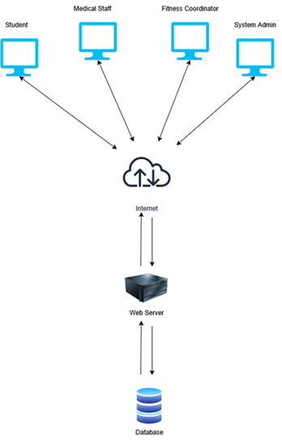

Figure 1.1 System Overview Diagram

The **Campus Wellness Portal** is an integrated digital platform
designed to streamline and enhance the health and wellness experience
for university students. By unifying access to medical services, fitness
activities, and personalized wellness resources, the portal serves as a
centralized hub for students to manage their physical, mental, and
emotional well-being.

**Key Features**

- **Medical System Integration**:

  - Schedule, cancel, or reschedule appointments with medical staff.

  - View and track personal medical history.

  - Receive notifications for upcoming appointments.

- **Fitness Center Integration**:

  - Book and manage fitness classes.

  - View weekly exercise timetables.

  - Avoid scheduling conflicts with academic commitments.

- **Personal Wellness Management**:

  - Set and track personalized health goals (e.g., fitness, sleep,
    > stress management).

  - Monitor progress through dashboards and analytics.

- **Tailored Health Resources**:

  - Access educational materials (e.g., meal preps, workout guides).

  - Receive personalized health advice and recommendations.

  - Enjoy curated media content (e.g., workout music, wellness videos).

- **User Support**:

  - Secure login with university credentials.

  - Online chat support for immediate assistance (limited availability).

  - Submit feedback to improve system functionality.

Figure 1.2 System Context Diagram

Aligned with the university\'s commitment to holistic student
well-being, the Campus Wellness Portal is designed to fulfil key
requirements that integrate health, fitness, and academic life, tailored
to the unique needs of students, medical staff, and fitness
coordinators.

### **1.3.2 Product Functions** {#product-functions}

### 

This is the overall use case diagram that shows all use case for all
actors

### 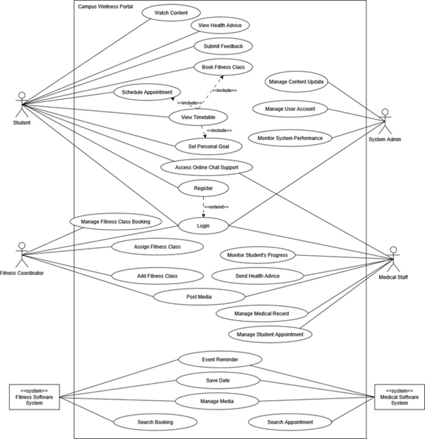

Figure 1.3: Use Case Diagram of the Campus Wellness Portal

#### 1.3.2.1 Student {#student}

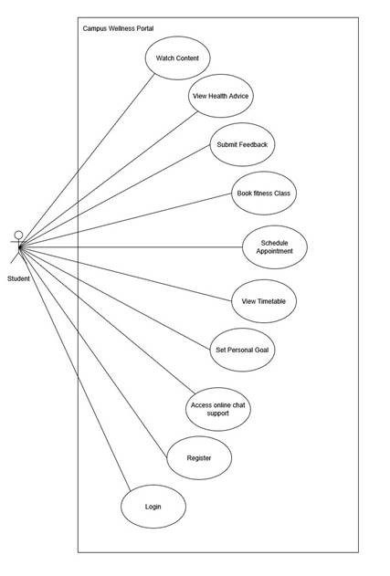

Figure 1.4: Use Case Diagram of Actor (Student)

Table 1.1: Use Case Diagram of Actor (Student)

| Use Case ID | Use Case Name              | Description                                                                                       |
|-------------|----------------------------|---------------------------------------------------------------------------------------------------|
| REQ_PFA001  | Watch Content              | Students can access personalized wellness media (e.g., workout videos, healthy cooking tutorials) |
| REQ_PFA002  | View Health Advice         | Students receive tailored health tips and recommendations from medical staff.                     |
| REQ_PFA003  | Submit Feedback            | Users share opinions or report issues about the portal's features or services.                    |
| REQ_PFA004  | Book Fitness Class         | Students reserve slots for fitness classes, avoiding schedule conflicts.                          |
| REQ_PFA005  | Schedule Appointment       | Students request, cancel, or reschedule medical appointments with university health staff.        |
| REQ_PFA006  | View Timetable             | Students check upcoming appointments, fitness classes, and wellness activities in one place.      |
| REQ_PFA007  | Set Personal Goal          | Students define and track wellness objectives (e.g., sleep hours, step count).                    |
| REQ_PFA008  | Access Online Chat Support | Students connect with medical/fitness staff for quick queries (if available).                     |
| REQ_PFA009  | Register                   | New users create an account using university credentials.                                         |
| REQ_PFA010  | Login                      | Registered users securely access the portal with their ID and password.                           |

#### 1.3.2.2 Medical Staff {#medical-staff}

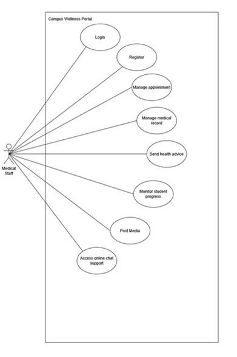

Figure 1.5: Use Case Diagram of Actor (Medical Staff)

Table 1.2: Use Case Diagram of Actor (Medical Staff)

| Use Case ID | Use Case Name              | Description                                                                               |
|-------------|----------------------------|-------------------------------------------------------------------------------------------|
| REQ_PFB001  | Login                      | Medical staff securely access the portal using university credentials.                    |
| REQ_PFB002  | Register                   | New medical staff create an account with verified university/admin approval.              |
| REQ_PFB003  | Manage Appointment         | Approve, reschedule, or cancel student appointments; add notes (e.g., denial reasons).    |
| REQ_PFB004  | Manage Medical Record      | View, update, or encrypt student health records (e.g., diagnoses, treatments).            |
| REQ_PFB005  | Send Health Advice         | Share personalized wellness recommendations with students via the portal.                 |
| REQ_PFB006  | Monitor Student Progress   | Track student health trends (e.g., vaccination status, fitness goals) through dashboards. |
| REQ_PFB007  | Post Media                 | Upload educational content (e.g., health tips, clinic announcements) for students.        |
| REQ_PFB008  | Access Online Chat Support | Respond to student queries in real-time (if available, per staff availability).           |

##   {#section-3}

#### 1.3.2.3 Fitness Coordinator {#fitness-coordinator}

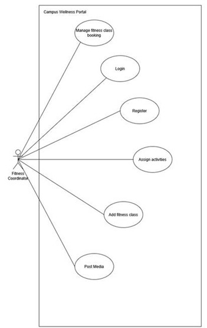

Figure 1.6: Use Case Diagram of Actor (Fitness Coordinator)

Table 1.3: Use Case Diagram of Actor (Medical Staff)

| Use Case ID | Use Case Name                | Description                                                                              |
|-------------|------------------------------|------------------------------------------------------------------------------------------|
| REQ_PFC001  | Manage Fitness Class Booking | Fitness coordinators securely access the system using university credentials.            |
| REQ_PFC002  | Login                        | New fitness coordinators create accounts with admin approval to manage fitness programs. |
| REQ_PFC003  | Register                     | Approve or deny student class bookings and manage class capacities.                      |
| REQ_PFC004  | Assign Activities            | Designate specific exercises or workouts for different fitness classes.                  |
| REQ_PFC005  | Add Fitness Class            | Create new class offerings with details like schedule, duration and required equipment.  |
| REQ_PFC006  | Post Media                   | Share workout videos, class announcements or motivational content with students.         |

##   {#section-4}

#### 1.3.2.4 System Admin {#system-admin}

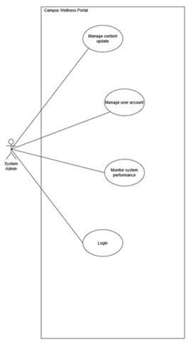

Figure 1.7: Use Case Diagram of Actor (System Admin)

Table 1.4: Use Case Diagram of Actor System Admin)

| Use Case ID | Use Case Name              | Description                                                                                   |
|-------------|----------------------------|-----------------------------------------------------------------------------------------------|
| REQ_PFD001  | Manage Content Update      | Approve and publish wellness resources, announcements, and system-wide notifications.         |
| REQ_PFD002  | Manage User Account        | Create, modify, or deactivate accounts for students, medical staff, and fitness coordinators. |
| REQ_PFD003  | Monitor System Performance | Track server status, usage metrics, and resolve technical issues to ensure smooth operation.  |
| REQ_PFD004  | Login                      | Admins securely access the system dashboard using elevated credentials.                       |

##   {#section-5}

#### 1.3.2.5 Fitness Software System {#fitness-software-system}

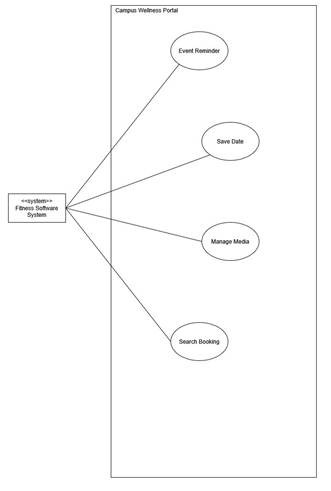

Figure 1.8: Use Case Diagram of Actor (Fitness Software System)

Table 1.5: Use Case Diagram of Actor (Fitness Software System)

| Use Case ID | Use Case Name  | Description                                                                                            |
|-------------|----------------|--------------------------------------------------------------------------------------------------------|
| REQ_PFE001  | Event Reminder | Automatically sends notifications to students about upcoming fitness classes or schedule changes.      |
| REQ_PFE002  | Save Date      | Allows students to bookmark fitness classes or events they want to attend.                             |
| REQ_PFE003  | Manage Media   | Enables fitness coordinators to upload, organize, and update workout videos and instructional content. |
| REQ_PFE004  | Search Booking | Provides students with a tool to find and check availability for fitness classes.                      |

##   {#section-6}

#### 1.3.2.6 Medical Software System {#medical-software-system}

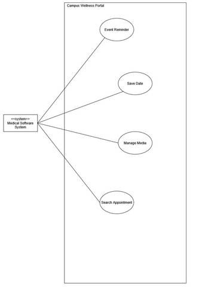

Figure 1.9: Use Case Diagram of Actor (Medical Software System)

Table 1.6: Use Case Diagram of Actor (Fitness Software System)

| Use Case ID | Use Case Name      | Description                                                                                                                  |
|-------------|--------------------|------------------------------------------------------------------------------------------------------------------------------|
| REQ_PFF001  | Event Reminder     | Automatically sends appointment reminders to students via email/notifications (e.g., 24 hours before scheduled visits).      |
| REQ_PFF002  | Save Date          | Allows students to bookmark preferred appointment slots or save medical staff availability for future reference.             |
| REQ_PFF003  | Manage Media       | Enables medical staff to securely upload and organize educational health materials (e.g., PDF guides, instructional videos). |
| REQ_PFF004  | Search Appointment | Provides students/staff with a tool to check real-time appointment availability and filter by date/staff/service type.       |

### **1.3.3 User characteristics** {#user-characteristics}

This section identifies the system\'s end users and evaluates their
expected familiarity with the platform, highlighting how their technical
proficiency may influence adoption and usage. The following table
outlines the anticipated knowledge level for each user role:

Table 1.7: User characteristics

| Role                | Description                                                                      | Expected Knowledge                                                                                                        |
|---------------------|----------------------------------------------------------------------------------|---------------------------------------------------------------------------------------------------------------------------|
| Student             | Primary users who schedule appointments, book classes, and track wellness goals. | Basic digital literacy (e.g., web browsing, form submission). No specialized training required.                           |
| Medical Staff       | Healthcare providers managing appointments, records, and student health data.    | Intermediate technical skills (e.g., Electronic Health Record (EHR) systems). Familiarity with data privacy protocols.    |
| Fitness Coordinator | Staff organizing fitness classes, assigning activities, and posting media.       | Basic system navigation. May need training for scheduling/booking management tools.                                       |
| System Admin        | IT personnel managing user accounts, system performance, and content updates.    | Advanced technical expertise (e.g., database management, Role-Based Access Control (RBAC). Requires full system training. |

###   {#section-7}

### **1.3.4 Limitations** {#limitations}

Every software development project operates within certain boundaries
that shape its scope and functionality. The Campus Wellness Portal is no
exception. While designed to streamline student wellness through
integrated medical and fitness services, the system faces inherent
constraints that influence its implementation and long-term
effectiveness.

This section outlines the key limitations of the project, covering
technical dependencies, resource restrictions, adoption challenges, and
compliance requirements. Understanding these constraints helps set
realistic expectations for stakeholders while identifying areas for
future improvement.

By acknowledging these limitations upfront, we ensure transparency about
the system's capabilities and provide a foundation for strategic
planning in subsequent development phases.

1.  **Integration Constraints  
    > ** Dependent on existing university systems with limited API
    > flexibility, restricting seamless data flow between
    > medical/fitness platforms.

2.  **Adoption Challenges  
    > ** Effectiveness relies on voluntary user engagement from students
    > and staff, with potential inconsistencies in participation.

3.  **Resource Restrictions  
    > ** Fixed MYR 100,000 budget and 2-year timeline limit advanced
    > features and scalability options.

4.  **Real-Time Limitations  
    > ** Slight delays in appointment/class updates may occur due to
    > backend synchronization dependencies.

5.  **Access & Compatibility  
    > ** Requires internet connectivity (no offline mode) and may have
    > reduced functionality on older devices/unsupported browsers.

## **1.4 Definitions** {#definitions}

This section provides clear definitions of key terms, roles, and
concepts used throughout the Campus Wellness Portal system. It ensures
consistent understanding among all stakeholders involved in the project.

Table 1.8 Definitions

| **Term**               | **Definition**                                                                      |
|------------------------|-------------------------------------------------------------------------------------|
| Campus Wellness Portal | A web-based platform for students to manage medical and fitness-related activities. |
| Appointment            | A scheduled meeting between a student and medical staff.                            |
| Fitness Class          | A physical activity session offered by the campus fitness center.                   |
| Student                | A user with access to features such as scheduling, goal setting, and booking.       |
| Medical Staff          | A health professional who can manage appointments and update student records.       |
| Fitness Coordinator    | A staff member responsible for managing and assigning fitness classes.              |
| Wellness Goal          | A personal objective related to fitness or health tracked by the student.           |
| Notification           | A message sent to users regarding appointments, classes, or system updates.         |
| Booking                | The act of reserving a slot for an appointment or class.                            |
| RBAC                   | Role-Based Access Control, which limits access based on user roles.                 |
| System Admin           | A privileged user responsible for managing users and overseeing system health.      |
| Progress Tracker       | A module to monitor students health or fitness goal achievement.                    |
| Api Integration        | A communication method that connects the portals to external systems.               |

#   {#section-8}

# **2. References** {#references}

**  
**IEEE. (2018). *ISO/IEC/IEEE 29148:2018 Systems and software
engineering---Life cycle processes---Requirements engineering*.
[[https://www.iso.org/standard/72089.html]{.underline}](https://www.iso.org/standard/72089.html)

Pohl, K. (2010). *Requirements engineering: Fundamentals, principles,
and techniques*. Springer.

Ministry of Health Malaysia. (2023). *Digital health guidelines*.
https://moh.gov.my/digitalhealth

Budiarto, R., & Yahaya, S. H. (2021). *Designing a unified health and
fitness portal for university students*. *Journal of Health
Informatics*, 10(2), 88--96.

Nielsen, J. (1995). *10 usability heuristics for user interface design*.
Nielsen Norman Group.

University of Waterloo. (n.d.). *Campus wellness*. University of
Waterloo.
[[https://portal.uwaterloo.ca/campusWellness]{.underline}](https://portal.uwaterloo.ca/campusWellness)**  
  
**Digital Design Professional. (n.d.). *CPRE Online Glossary*. CPRE.
[[https://cpre.ireb.org/en/downloads-and-resources/glossary]{.underline}](https://cpre.ireb.org/en/downloads-and-resources/glossary)

# **3. Requirements** {#requirements}

## **3.1 Functions** {#functions}

**  
**This section outlines the main functions the Campus Wellness Portal
must perform. Each requirement describes specific features that the
system should support, based on user roles and system objectives.

Table 3.1 Function Requirements

| Requirement            | Description                                                                                         | Priority |
|------------------------|-----------------------------------------------------------------------------------------------------|----------|
| User Login             | The system shall allow students, staff and coordinators to securely log in using their credentials. | High     |
| Schedule Appointment   | The system shall allow students to schedule, cancel, or reschedule appointments with medical staff. | High     |
| Book Fitness Class     | The system shall allow students to browse, book, and cancel fitness classes.                        | High     |
| Manage Goals           | The system shall allow students to set, update, and track personal wellness goals.                  | Medium   |
| Update Medical Records | Medical staff shall be able to access and update student medical records.                           | High     |
| Post Announcement      | Fitness coordinators and medical staff shall be able to post announcements or health updates.       | Medium   |
| Assign Fitness Classes | Fitness coordinators shall assign trainers to scheduled fitness classes.                            | Medium   |
| Manage User Accounts   | Admins shall manage user roles, activate/deactivate accounts, and perform access control.           | High     |

### **3.1.1 Sequence Diagram** {#sequence-diagram}

#### **3.1.1.1 Login (All Users)** {#login-all-users}

<table>
<colgroup>
<col style="width: 24%" />
<col style="width: 75%" />
</colgroup>
<thead>
<tr class="header">
<th>ID</th>
<th>REQ_SD001</th>
</tr>
<tr class="odd">
<th>Feature</th>
<th>Login</th>
</tr>
<tr class="header">
<th>Purpose</th>
<th>To allow end users to login and authenticate themselves in the
system.</th>
</tr>
<tr class="odd">
<th>Actor</th>
<th>Student/ Medical staff/ Fitness coordinator/ System admin</th>
</tr>
<tr class="header">
<th>Precondition</th>
<th>Enter credentials ID and password.</th>
</tr>
<tr class="odd">
<th>Postcondition</th>
<th>The end user will be logged in and the system will let them be able
to access the portal.</th>
</tr>
<tr class="header">
<th>Main Flow</th>
<th><ol type="1">
<li><blockquote>

Actor navigates to the login page.

</blockquote></li>
<li><blockquote>

System displays the login page.

</blockquote></li>
<li><blockquote>

Actor fills in their credentials and password.

</blockquote></li>
<li><blockquote>

System verifies the values entered.

</blockquote></li>
<li><blockquote>

System authenticates the actor.

</blockquote></li>
<li><blockquote>

System returns successfully and displays the portal.

</blockquote></li>
</ol></th>
</tr>
<tr class="odd">
<th>Alternate Scenario</th>
<th>System returns fail when the values cannot be found.</th>
</tr>
</thead>
<tbody>
</tbody>
</table>

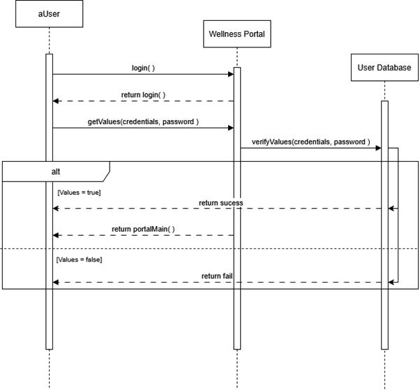

Figure 3.1 Login Sequence Diagram

#### **3.1.1.2 Register (All Users except System Admin)** {#register-all-users-except-system-admin}

<table>
<colgroup>
<col style="width: 24%" />
<col style="width: 75%" />
</colgroup>
<thead>
<tr class="header">
<th>ID</th>
<th>REQ_SD002</th>
</tr>
<tr class="odd">
<th>Feature</th>
<th>Register</th>
</tr>
<tr class="header">
<th>Purpose</th>
<th>To allow new end users to register an account to access the
system.</th>
</tr>
<tr class="odd">
<th>Actor</th>
<th>Student/ Medical staff/ Fitness coordinator</th>
</tr>
<tr class="header">
<th>Precondition</th>
<th>Enter credentials ID and password.</th>
</tr>
<tr class="odd">
<th>Postcondition</th>
<th>The end user will be logged in and the system will let them be able
to access the portal.</th>
</tr>
<tr class="header">
<th>Main Flow</th>
<th><ol type="1">
<li><blockquote>

Actor navigates to the register page.

</blockquote></li>
<li><blockquote>

System displays the register page.

</blockquote></li>
<li><blockquote>

Actor fills in their credentials.

</blockquote></li>
<li><blockquote>

System searches for existing credentials without a password.

</blockquote></li>
<li><blockquote>

System returns the credentials.

</blockquote></li>
<li><blockquote>

Actor sets a new password.

</blockquote></li>
<li><blockquote>

System returns successfully and displays the portal.

</blockquote></li>
</ol></th>
</tr>
<tr class="odd">
<th>Alternate Scenario</th>
<th>System returns account already exists if credentials with a password
are returned.</th>
</tr>
</thead>
<tbody>
</tbody>
</table>

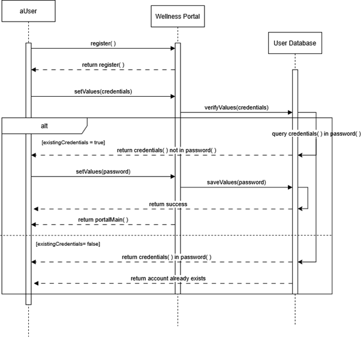

Figure 3.2 Register Sequence Diagram

#### **3.1.1.3 Schedule Appointment (Student)** {#schedule-appointment-student}

<table>
<colgroup>
<col style="width: 24%" />
<col style="width: 75%" />
</colgroup>
<thead>
<tr class="header">
<th>ID</th>
<th>REQ_SD003</th>
</tr>
<tr class="odd">
<th>Feature</th>
<th>Schedule Appointment</th>
</tr>
<tr class="header">
<th>Purpose</th>
<th>Allows users to schedule an appointment with a medical staff.</th>
</tr>
<tr class="odd">
<th>Actor</th>
<th>Student</th>
</tr>
<tr class="header">
<th>Precondition</th>
<th>User successfully logged in.</th>
</tr>
<tr class="odd">
<th>Postcondition</th>
<th>An appointment will be scheduled.</th>
</tr>
<tr class="header">
<th>Main Flow</th>
<th><ol type="1">
<li><blockquote>

Actor navigates to the appointment page.

</blockquote></li>
<li><blockquote>

System returns the timeslot menu.

</blockquote></li>
<li><blockquote>

Actor selects a time slot from the timeslot menu.

</blockquote></li>
<li><blockquote>

System sends a confirmation to the medical staff.

</blockquote></li>
<li><blockquote>

Medical staff approves the time slot.

</blockquote></li>
<li><blockquote>

System returns success, and saves the time slot to the timetable.

</blockquote></li>
</ol></th>
</tr>
<tr class="odd">
<th>Alternate Scenario</th>
<th>System returns appointment schedule failed if medical staff denies
time slot.</th>
</tr>
</thead>
<tbody>
</tbody>
</table>

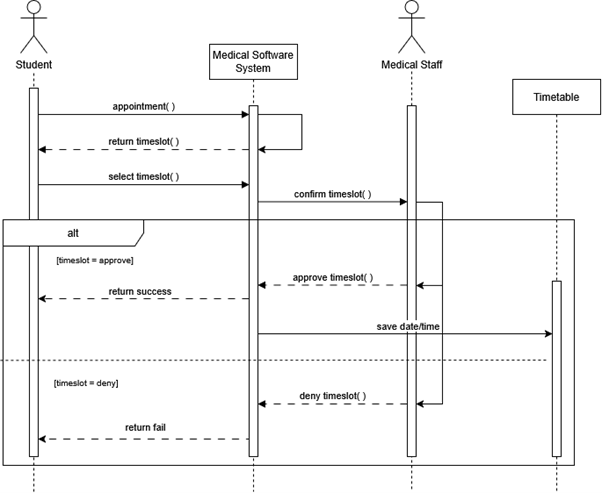

Figure 3.3 Schedule Appointment Sequence Diagram

#### **3.1.1.4 Book Fitness Class (Student)** {#book-fitness-class-student}

<table>
<colgroup>
<col style="width: 24%" />
<col style="width: 75%" />
</colgroup>
<thead>
<tr class="header">
<th>ID</th>
<th>REQ_SD004</th>
</tr>
<tr class="odd">
<th>Feature</th>
<th>Book Fitness Class</th>
</tr>
<tr class="header">
<th>Purpose</th>
<th>Allows users to book a fitness class for recreational purposes.</th>
</tr>
<tr class="odd">
<th>Actor</th>
<th>Student</th>
</tr>
<tr class="header">
<th>Precondition</th>
<th>User successfully logged in.</th>
</tr>
<tr class="odd">
<th>Postcondition</th>
<th>A booking will be reserved.</th>
</tr>
<tr class="header">
<th>Main Flow</th>
<th><ol type="1">
<li><blockquote>

Actor navigates to the booking page.

</blockquote></li>
<li><blockquote>

System returns the booking menu.

</blockquote></li>
<li><blockquote>

Actor searches for an activity in the booking menu.

</blockquote></li>
<li><blockquote>

System returns timeslot menu found in activity.

</blockquote></li>
<li><blockquote>

Actor selects a time slot in timeslot menu.

</blockquote></li>
<li><blockquote>

System sends a confirmation to the fitness coordinator.

</blockquote></li>
<li><blockquote>

Fitness coordinator approves the time slot.

</blockquote></li>
<li><blockquote>

System returns success, and saves the time slot to the timetable.

</blockquote></li>
</ol></th>
</tr>
<tr class="odd">
<th>Alternate Scenario</th>
<th>System returns booking reservation failed if fitness coordinator
denies time slot.</th>
</tr>
</thead>
<tbody>
</tbody>
</table>

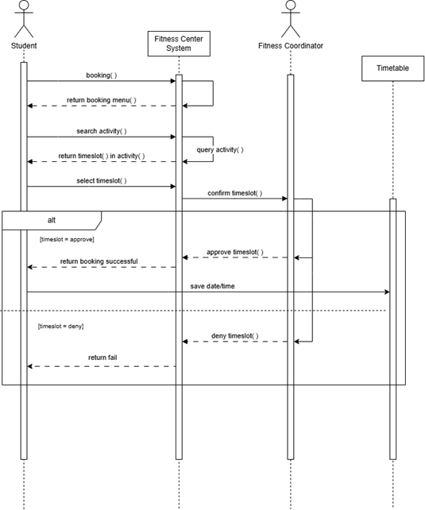

Figure 3.4 Book Fitness Sequence Diagram

####   {#section-9}

#### **3.1.1.5 Set Goal (Student)** {#set-goal-student}

<table>
<colgroup>
<col style="width: 24%" />
<col style="width: 75%" />
</colgroup>
<thead>
<tr class="header">
<th>ID</th>
<th>REQ_SD005</th>
</tr>
<tr class="odd">
<th>Feature</th>
<th>Set Goal</th>
</tr>
<tr class="header">
<th>Purpose</th>
<th>Allows users to set and track their goals.</th>
</tr>
<tr class="odd">
<th>Actor</th>
<th>Student</th>
</tr>
<tr class="header">
<th>Precondition</th>
<th>User successfully logged in.</th>
</tr>
<tr class="odd">
<th>Postcondition</th>
<th>A new goal will be set.</th>
</tr>
<tr class="header">
<th>Main Flow</th>
<th><ol type="1">
<li><blockquote>

Actor access dashboard.

</blockquote></li>
<li><blockquote>

System returns and displays dashboard.

</blockquote></li>
<li><blockquote>

Actor access goal page.

</blockquote></li>
<li><blockquote>

System returns and displays the goal page.

</blockquote></li>
<li><blockquote>

Actor selects the set goal function and the time slot.

</blockquote></li>
<li><blockquote>

System creates a new goal in the timetable, returns success, and
returns to the goal page.

</blockquote></li>
</ol></th>
</tr>
<tr class="odd">
<th>Alternate Scenario</th>
<th>System returns a goal in the timetable if the actor chooses the
track goal function.</th>
</tr>
</thead>
<tbody>
</tbody>
</table>

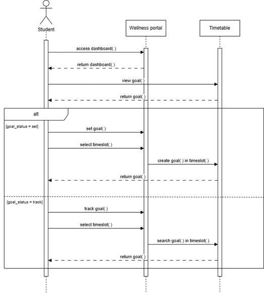

Figure 3.5 Set Goals Sequence Diagram

####   {#section-10}

#### **3.1.1.6 View Timetable (Student)** {#view-timetable-student}

<table>
<colgroup>
<col style="width: 24%" />
<col style="width: 75%" />
</colgroup>
<thead>
<tr class="header">
<th>ID</th>
<th>REQ_SD006</th>
</tr>
<tr class="odd">
<th>Feature</th>
<th>View timetable</th>
</tr>
<tr class="header">
<th>Purpose</th>
<th>Allows users to view their appointment, booking, and goal.</th>
</tr>
<tr class="odd">
<th>Actor</th>
<th>Student</th>
</tr>
<tr class="header">
<th>Precondition</th>
<th>User successfully logged in.</th>
</tr>
<tr class="odd">
<th>Postcondition</th>
<th>Displays the timetable.</th>
</tr>
<tr class="header">
<th>Main Flow</th>
<th><ol type="1">
<li><blockquote>

Actor navigates to the timetable page.

</blockquote></li>
<li><blockquote>

System returns and displays the timetable page.

</blockquote></li>
<li><blockquote>

Actor selects a time slot.

</blockquote></li>
<li><blockquote>

System searches for the time slot in the timeslot menu.

</blockquote></li>
<li><blockquote>

System returns and displays the appointment, booking, and goal found
in the time slot.

</blockquote></li>
</ol></th>
</tr>
<tr class="odd">
<th>Alternate Scenario</th>
<th>-</th>
</tr>
</thead>
<tbody>
</tbody>
</table>

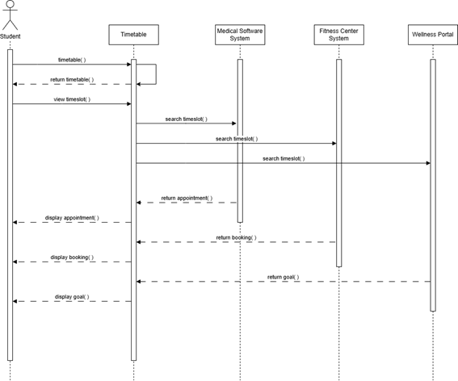

Figure 3.6 View Timetable Sequence Diagram

####   {#section-11}

#### **3.1.1.7 Watch Content (Student)** {#watch-content-student}

<table>
<colgroup>
<col style="width: 24%" />
<col style="width: 75%" />
</colgroup>
<thead>
<tr class="header">
<th>ID</th>
<th>REQ_SD007</th>
</tr>
<tr class="odd">
<th>Feature</th>
<th>Watch content</th>
</tr>
<tr class="header">
<th>Purpose</th>
<th>Allows users to access media content for education and entertainment
purposes.</th>
</tr>
<tr class="odd">
<th>Actor</th>
<th>Student</th>
</tr>
<tr class="header">
<th>Precondition</th>
<th>User successfully logged in.</th>
</tr>
<tr class="odd">
<th>Postcondition</th>
<th>Content is played.</th>
</tr>
<tr class="header">
<th>Main Flow</th>
<th><ol type="1">
<li><blockquote>

Actor navigates to the dashboard page.

</blockquote></li>
<li><blockquote>

System returns and displays the dashboard page.

</blockquote></li>
<li><blockquote>

Actor navigates to the channel page.

</blockquote></li>
<li><blockquote>

System returns and displays the content in the channel page.

</blockquote></li>
<li><blockquote>

Actor selects the content.

</blockquote></li>
<li><blockquote>

System returns and displays the content.

</blockquote></li>
</ol></th>
</tr>
<tr class="odd">
<th>Alternate Scenario</th>
<th>-</th>
</tr>
</thead>
<tbody>
</tbody>
</table>

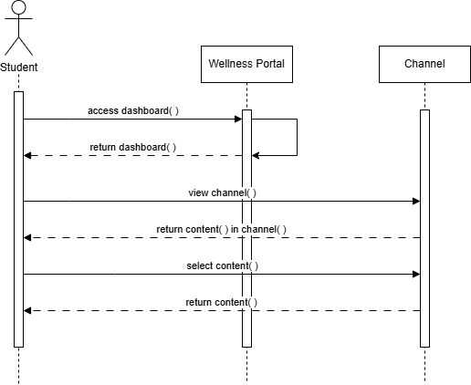

Figure 3.7 Watch Content Sequence Diagram

#### **3.1.1.8 View Health Advice (Student)** {#view-health-advice-student}

<table>
<colgroup>
<col style="width: 24%" />
<col style="width: 75%" />
</colgroup>
<thead>
<tr class="header">
<th>ID</th>
<th>REQ_SD008</th>
</tr>
<tr class="odd">
<th>Feature</th>
<th>View Health Advice</th>
</tr>
<tr class="header">
<th>Purpose</th>
<th>Allows users to access general health advice.</th>
</tr>
<tr class="odd">
<th>Actor</th>
<th>Student</th>
</tr>
<tr class="header">
<th>Precondition</th>
<th>User successfully logged in.</th>
</tr>
<tr class="odd">
<th>Postcondition</th>
<th>Displays the advice.</th>
</tr>
<tr class="header">
<th>Main Flow</th>
<th><ol type="1">
<li><blockquote>

Actor navigates to the dashboard page.

</blockquote></li>
<li><blockquote>

System returns and displays the dashboard page.

</blockquote></li>
<li><blockquote>

Actor navigates to the health forum page.

</blockquote></li>
<li><blockquote>

System searches for userID in the health forum page.

</blockquote></li>
<li><blockquote>

System returns and displays the advice found in the health forum
page.

</blockquote></li>
</ol></th>
</tr>
<tr class="odd">
<th>Alternate Scenario</th>
<th>-</th>
</tr>
</thead>
<tbody>
</tbody>
</table>

#### ** ** {#section-12}

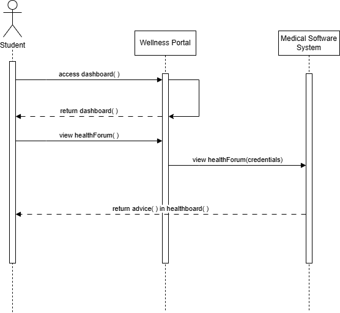

Figure 3.8 View Health Advice Sequence Diagram

####   {#section-13}

#### **3.1.1.9 Access Online Chat (Student & Medical Staff)** {#access-online-chat-student-medical-staff}

<table>
<colgroup>
<col style="width: 24%" />
<col style="width: 75%" />
</colgroup>
<thead>
<tr class="header">
<th>ID</th>
<th>REQ_SD009</th>
</tr>
<tr class="odd">
<th>Feature</th>
<th>View Health Advice</th>
</tr>
<tr class="header">
<th>Purpose</th>
<th>Enables communication between students and medical staff.</th>
</tr>
<tr class="odd">
<th>Actor</th>
<th>Student / Medical Staff</th>
</tr>
<tr class="header">
<th>Precondition</th>
<th>Both actors are successfully logged in and are online.</th>
</tr>
<tr class="odd">
<th>Postcondition</th>
<th>Chat session is initiated.</th>
</tr>
<tr class="header">
<th>Main Flow</th>
<th><ol type="1">
<li><blockquote>

Actor opens the chat interface.

</blockquote></li>
<li><blockquote>

System loads previous conversations (if any).

</blockquote></li>
<li><blockquote>

Actor sends and receives messages.

</blockquote></li>
</ol></th>
</tr>
<tr class="odd">
<th>Alternate Scenario</th>
<th>System returns "chat unavailable" if server connection fails.</th>
</tr>
</thead>
<tbody>
</tbody>
</table>

####  {#section-14}

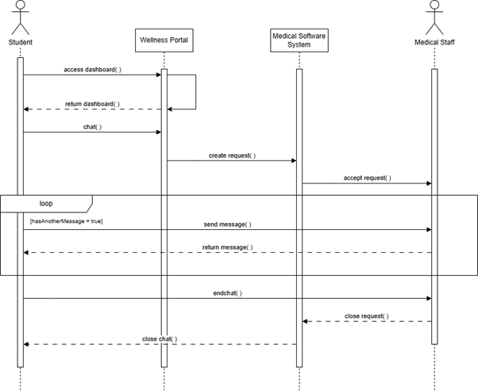

Figure 3.9 Access Online Chat Sequence Diagram

####   {#section-15}

#### **3.1.1.10 Submit Feedback (Student)** {#submit-feedback-student}

<table>
<colgroup>
<col style="width: 24%" />
<col style="width: 75%" />
</colgroup>
<thead>
<tr class="header">
<th>ID</th>
<th>REQ_SD010</th>
</tr>
<tr class="odd">
<th>Feature</th>
<th>Submit Feedback</th>
</tr>
<tr class="header">
<th>Purpose</th>
<th>Allows users to provide feedback on services or features.</th>
</tr>
<tr class="odd">
<th>Actor</th>
<th>Student</th>
</tr>
<tr class="header">
<th>Precondition</th>
<th>User successfully logged in</th>
</tr>
<tr class="odd">
<th>Postcondition</th>
<th>Feedback is submitted and saved.</th>
</tr>
<tr class="header">
<th>Main Flow</th>
<th><ol type="1">
<li><blockquote>

Actor navigates to the feedback form.

</blockquote></li>
<li><blockquote>

Actor fills in feedback.

</blockquote></li>
<li><blockquote>

Actor submits the form.

</blockquote></li>
<li><blockquote>

System confirms submission.

</blockquote></li>
</ol></th>
</tr>
<tr class="odd">
<th>Alternate Scenario</th>
<th>System returns "submission failed" if required fields are
empty.</th>
</tr>
</thead>
<tbody>
</tbody>
</table>

####  {#section-16}

![]src/F3.10.png)

Figure 3.10 Submit Feedback Sequence Diagram

####   {#section-17}

#### **3.1.1.11 Manage Appointment (Medical Staff)** {#manage-appointment-medical-staff}

<table>
<colgroup>
<col style="width: 24%" />
<col style="width: 75%" />
</colgroup>
<thead>
<tr class="header">
<th>ID</th>
<th>REQ_SD011</th>
</tr>
<tr class="odd">
<th>Feature</th>
<th>Manage Appointment</th>
</tr>
<tr class="header">
<th>Purpose</th>
<th>Enables management of scheduled appointments.</th>
</tr>
<tr class="odd">
<th>Actor</th>
<th>Medical Staff</th>
</tr>
<tr class="header">
<th>Precondition</th>
<th>User successfully logged in</th>
</tr>
<tr class="odd">
<th>Postcondition</th>
<th>Appointment is updated, canceled, or confirmed.</th>
</tr>
<tr class="header">
<th>Main Flow</th>
<th><ol type="1">
<li><blockquote>

Actor navigates to the appointment management panel.

</blockquote></li>
<li><blockquote>

System lists all scheduled appointments time slots.

</blockquote></li>
<li><blockquote>

Actor selects and approves the time slot.

</blockquote></li>
<li><blockquote>

System saves changes.

</blockquote></li>
</ol></th>
</tr>
<tr class="odd">
<th>Alternate Scenario</th>
<th>Actor denies the time slot, and enters the reasoning for the
denial.</th>
</tr>
</thead>
<tbody>
</tbody>
</table>

####  {#section-18}

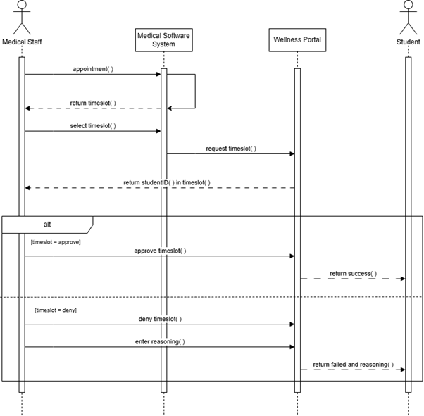

Figure 3.11 Manage Appointment Sequence Diagram

####   {#section-19}

#### **3.1.1.12 Update Medical Record (Medical Staff)** {#update-medical-record-medical-staff}

<table>
<colgroup>
<col style="width: 24%" />
<col style="width: 75%" />
</colgroup>
<thead>
<tr class="header">
<th>ID</th>
<th>REQ_SD012</th>
</tr>
<tr class="odd">
<th>Feature</th>
<th>Update Medical Record</th>
</tr>
<tr class="header">
<th>Purpose</th>
<th>Allows viewing and updating of student medical records.</th>
</tr>
<tr class="odd">
<th>Actor</th>
<th>Medical Staff</th>
</tr>
<tr class="header">
<th>Precondition</th>
<th>User successfully logged in</th>
</tr>
<tr class="odd">
<th>Postcondition</th>
<th>Medical records are updated or viewed.</th>
</tr>
<tr class="header">
<th>Main Flow</th>
<th><ol type="1">
<li><blockquote>

Actor navigates to the student record page.

</blockquote></li>
<li><blockquote>

System fetches the record.

</blockquote></li>
<li><blockquote>

Actor reviews and edits information.

</blockquote></li>
<li><blockquote>

Actor enters their credential and password.

</blockquote></li>
<li><blockquote>

System validates the user.

</blockquote></li>
<li><blockquote>

System saves updates.

</blockquote></li>
</ol></th>
</tr>
<tr class="odd">
<th>Alternate Scenario</th>
<th>System returns fail if credential or passwords are invalid.</th>
</tr>
</thead>
<tbody>
</tbody>
</table>

####  {#section-20}

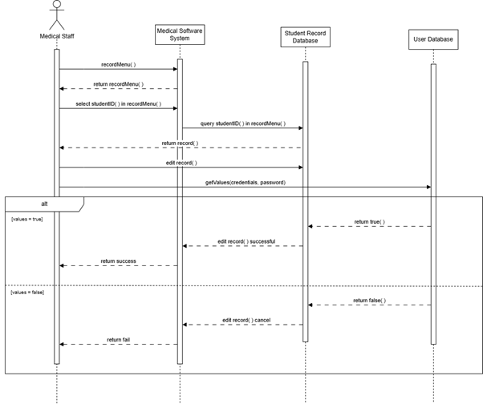

Figure 3.12 Medical Record Sequence Diagram

####   {#section-21}

#### **3.1.1.13 Send Health Advice (Medical Staff)** {#send-health-advice-medical-staff}

<table>
<colgroup>
<col style="width: 24%" />
<col style="width: 75%" />
</colgroup>
<thead>
<tr class="header">
<th>ID</th>
<th>REQ_SD013</th>
</tr>
<tr class="odd">
<th>Feature</th>
<th>Send Health Advice</th>
</tr>
<tr class="header">
<th>Purpose</th>
<th>Allows medical staff to provide personalized advice to
students.</th>
</tr>
<tr class="odd">
<th>Actor</th>
<th>Medical Staff</th>
</tr>
<tr class="header">
<th>Precondition</th>
<th>User successfully logged in</th>
</tr>
<tr class="odd">
<th>Postcondition</th>
<th>Health advice is sent and stored.</th>
</tr>
<tr class="header">
<th>Main Flow</th>
<th><ol type="1">
<li><blockquote>

Actor accesses the student profile.

</blockquote></li>
<li><blockquote>

Actor writes health advice.

</blockquote></li>
<li><blockquote>

System sends and stores the advice.

</blockquote></li>
</ol></th>
</tr>
<tr class="odd">
<th>Alternate Scenario</th>
<th>System returns "student not found" or delivery failed.</th>
</tr>
</thead>
<tbody>
</tbody>
</table>

####  {#section-22}

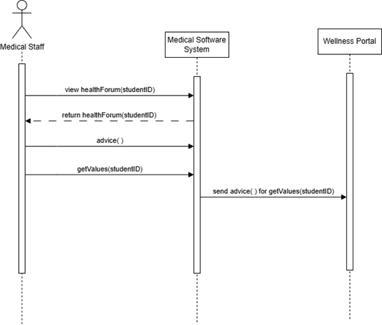

Figure 3.13 Send Health Advice Sequence Diagram

#### **3.1.1.14 Monitor Student Progress (Medical Staff)** {#monitor-student-progress-medical-staff}

<table>
<colgroup>
<col style="width: 24%" />
<col style="width: 75%" />
</colgroup>
<thead>
<tr class="header">
<th>ID</th>
<th>REQ_SD014</th>
</tr>
<tr class="odd">
<th>Feature</th>
<th>Monitor Student Progress</th>
</tr>
<tr class="header">
<th>Purpose</th>
<th>Allows monitoring of student’s health or goal progress.</th>
</tr>
<tr class="odd">
<th>Actor</th>
<th>Medical Staff</th>
</tr>
<tr class="header">
<th>Precondition</th>
<th>User successfully logged in</th>
</tr>
<tr class="odd">
<th>Postcondition</th>
<th>Progress data is displayed.</th>
</tr>
<tr class="header">
<th>Main Flow</th>
<th><ol type="1">
<li><blockquote>

Actor selects a student.

</blockquote></li>
<li><blockquote>

System retrieves historical data.

</blockquote></li>
<li><blockquote>

System generates and displays progress reports.

</blockquote></li>
</ol></th>
</tr>
<tr class="odd">
<th>Alternate Scenario</th>
<th>System returns "no data available" for the selected student.</th>
</tr>
</thead>
<tbody>
</tbody>
</table>

####  {#section-23}

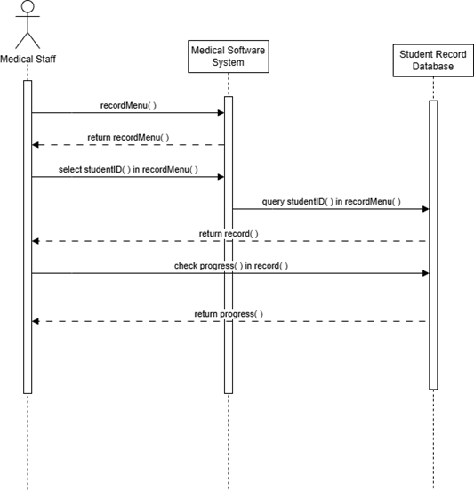

Figure 3.14 Monitor Student Progress Sequence Diagram

####   {#section-24}

#### **3.1.1.15 Post Media (Medical Staff & Fitness Coordinator)** {#post-media-medical-staff-fitness-coordinator}

<table>
<colgroup>
<col style="width: 24%" />
<col style="width: 75%" />
</colgroup>
<thead>
<tr class="header">
<th>ID</th>
<th>REQ_SD015</th>
</tr>
<tr class="odd">
<th>Feature</th>
<th>Post Media</th>
</tr>
<tr class="header">
<th>Purpose</th>
<th>Allows posting of health-related or fitness-related media.</th>
</tr>
<tr class="odd">
<th>Actor</th>
<th>Medical Staff / Fitness Coordinator</th>
</tr>
<tr class="header">
<th>Precondition</th>
<th>User successfully logged in</th>
</tr>
<tr class="odd">
<th>Postcondition</th>
<th>Media is posted and accessible to users.</th>
</tr>
<tr class="header">
<th>Main Flow</th>
<th><ol type="1">
<li><blockquote>

Actor navigates to the post media page.

</blockquote></li>
<li><blockquote>

Actor uploads content and provides description.

</blockquote></li>
<li><blockquote>

System saves and displays the media.

</blockquote></li>
</ol></th>
</tr>
<tr class="odd">
<th>Alternate Scenario</th>
<th>System returns "upload failed".</th>
</tr>
</thead>
<tbody>
</tbody>
</table>

####  {#section-25}

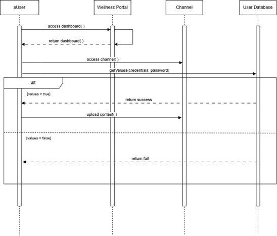

Figure 3.15 Post Media Sequence Diagram

#### **3.1.1.16 Assign Fitness Class (Fitness Coordinator)** {#assign-fitness-class-fitness-coordinator}

<table>
<colgroup>
<col style="width: 24%" />
<col style="width: 75%" />
</colgroup>
<thead>
<tr class="header">
<th>ID</th>
<th>REQ_SD016</th>
</tr>
<tr class="odd">
<th>Feature</th>
<th>Assign Fitness Class</th>
</tr>
<tr class="header">
<th>Purpose</th>
<th>Assign activities to fitness classes.</th>
</tr>
<tr class="odd">
<th>Actor</th>
<th>Fitness Coordinator</th>
</tr>
<tr class="header">
<th>Precondition</th>
<th>User successfully logged in</th>
</tr>
<tr class="odd">
<th>Postcondition</th>
<th>Activity is assigned to the selected class.</th>
</tr>
<tr class="header">
<th>Main Flow</th>
<th><ol type="1">
<li><blockquote>

Actor navigates to the class menu page.

</blockquote></li>
<li><blockquote>

System returns and displays the class menu page.

</blockquote></li>
<li><blockquote>

Actor selects a class and assigns an activity to the class.

</blockquote></li>
<li><blockquote>

Actor enters their credential and password.

</blockquote></li>
<li><blockquote>

System validates the user.

</blockquote></li>
<li><blockquote>

System returns success and saves activity into class.

</blockquote></li>
</ol></th>
</tr>
<tr class="odd">
<th>Alternate Scenario</th>
<th>System returns fail if credential or password are invalid.</th>
</tr>
</thead>
<tbody>
</tbody>
</table>

####  {#section-26}

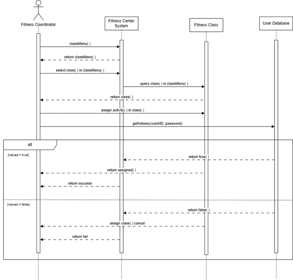

Figure 3.16 Assign Fitness Class Sequence Diagram

#### **3.1.1.17 Manage Fitness Class Booking (Fitness Coordinator)** {#manage-fitness-class-booking-fitness-coordinator}

<table>
<colgroup>
<col style="width: 24%" />
<col style="width: 75%" />
</colgroup>
<thead>
<tr class="header">
<th>ID</th>
<th>REQ_SD017</th>
</tr>
<tr class="odd">
<th>Feature</th>
<th>Manage Fitness Class Booking</th>
</tr>
<tr class="header">
<th>Purpose</th>
<th>Allows management of fitness class bookings.</th>
</tr>
<tr class="odd">
<th>Actor</th>
<th>Fitness Coordinator</th>
</tr>
<tr class="header">
<th>Precondition</th>
<th>User successfully logged in</th>
</tr>
<tr class="odd">
<th>Postcondition</th>
<th>Booking list is managed and updated.</th>
</tr>
<tr class="header">
<th>Main Flow</th>
<th><ol type="1">
<li><blockquote>

Actor navigates to the booking management panel.

</blockquote></li>
<li><blockquote>

System lists all scheduled booked time slots.

</blockquote></li>
<li><blockquote>

Actor selects and approves the time slot.

</blockquote></li>
<li><blockquote>

System saves changes.

</blockquote></li>
</ol></th>
</tr>
<tr class="odd">
<th>Alternate Scenario</th>
<th>Actor denies the time slot.</th>
</tr>
</thead>
<tbody>
</tbody>
</table>

####  {#section-27}

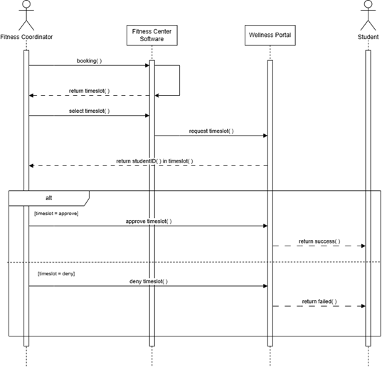

Figure 3.17 Manage Fitness Class Booking Sequence Diagram

####   {#section-28}

#### **3.1.1.18 Add Fitness Class (Fitness Coordinator)** {#add-fitness-class-fitness-coordinator}

<table>
<colgroup>
<col style="width: 24%" />
<col style="width: 75%" />
</colgroup>
<thead>
<tr class="header">
<th>ID</th>
<th>REQ_SD018</th>
</tr>
<tr class="odd">
<th>Feature</th>
<th>Add Fitness Class</th>
</tr>
<tr class="header">
<th>Purpose</th>
<th>Enables creation of new fitness class entries.</th>
</tr>
<tr class="odd">
<th>Actor</th>
<th>Fitness Coordinator</th>
</tr>
<tr class="header">
<th>Precondition</th>
<th>User successfully logged in</th>
</tr>
<tr class="odd">
<th>Postcondition</th>
<th>New fitness class is added to the system.</th>
</tr>
<tr class="header">
<th>Main Flow</th>
<th><ol type="1">
<li><blockquote>

Actor opens the class menu.

</blockquote></li>
<li><blockquote>

System returns and displays the class menu.

</blockquote></li>
<li><blockquote>

Actor selects the add class option and enters their credential and
password.

</blockquote></li>
<li><blockquote>

System validates the actor.

</blockquote></li>
<li><blockquote>

System saves and publishes the class.

</blockquote></li>
</ol></th>
</tr>
<tr class="odd">
<th>Alternate Scenario</th>
<th>System returns “invalid input".</th>
</tr>
</thead>
<tbody>
</tbody>
</table>

####  {#section-29}

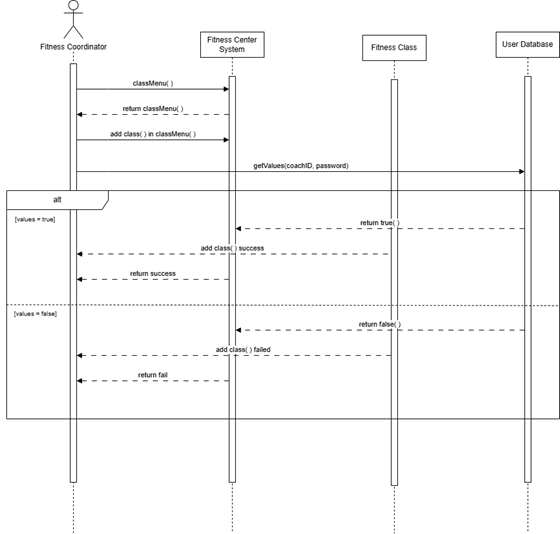

Figure 3.18 Add Fitness Class Sequence Diagram

#### **3.1.1.19 Manage User Account (System Admin)** {#manage-user-account-system-admin}

<table>
<colgroup>
<col style="width: 24%" />
<col style="width: 75%" />
</colgroup>
<thead>
<tr class="header">
<th>ID</th>
<th>REQ_SD019</th>
</tr>
<tr class="odd">
<th>Feature</th>
<th>Manage User Account</th>
</tr>
<tr class="header">
<th>Purpose</th>
<th>Allows system admin to create, update, or delete user accounts.</th>
</tr>
<tr class="odd">
<th>Actor</th>
<th>Fitness Coordinator</th>
</tr>
<tr class="header">
<th>Precondition</th>
<th>User successfully logged in</th>
</tr>
<tr class="odd">
<th>Postcondition</th>
<th>User account is modified as needed.</th>
</tr>
<tr class="header">
<th>Main Flow</th>
<th><ol type="1">
<li><blockquote>

Actor opens the user management panel.

</blockquote></li>
<li><blockquote>

Actor selects the user.

</blockquote></li>
<li><blockquote>

Actor updates or deletes the user.

</blockquote></li>
<li><blockquote>

System confirms and applies changes.

</blockquote></li>
</ol></th>
</tr>
<tr class="odd">
<th>Alternate Scenario</th>
<th>System returns "user not found" or insufficient permissions.</th>
</tr>
</thead>
<tbody>
</tbody>
</table>

####  {#section-30}

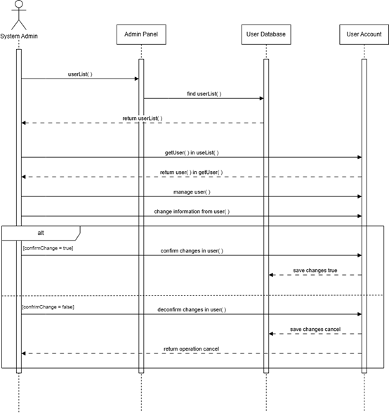

Figure 3.19 Manage User Account Sequence Diagram

####   {#section-31}

#### **3.1.1.20 Monitor System Performance (System Admin)** {#monitor-system-performance-system-admin}

<table>
<colgroup>
<col style="width: 24%" />
<col style="width: 75%" />
</colgroup>
<thead>
<tr class="header">
<th>ID</th>
<th>REQ_SD020</th>
</tr>
<tr class="odd">
<th>Feature</th>
<th>Monitor System Performance</th>
</tr>
<tr class="header">
<th>Purpose</th>
<th>Enables monitoring of system performance, logs, and server
health.</th>
</tr>
<tr class="odd">
<th>Actor</th>
<th>Fitness Coordinator</th>
</tr>
<tr class="header">
<th>Precondition</th>
<th>User successfully logged in</th>
</tr>
<tr class="odd">
<th>Postcondition</th>
<th>System performance data is displayed.</th>
</tr>
<tr class="header">
<th>Main Flow</th>
<th><ol type="1">
<li><blockquote>

Actor navigates to the system monitor.

</blockquote></li>
<li><blockquote>

System displays usage logs, server status, and metrics.

</blockquote></li>
</ol></th>
</tr>
<tr class="odd">
<th>Alternate Scenario</th>
<th>System returns "logs unavailable" or data fetch error.</th>
</tr>
</thead>
<tbody>
</tbody>
</table>

####  {#section-32}

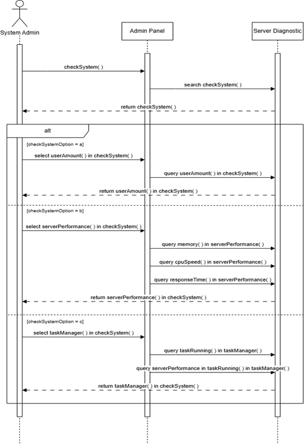

Figure 3.20 Monitor System Performance Sequence Diagram

####   {#section-33}

#### **3.1.1.21 Manage Content Updates (System Admin)** {#manage-content-updates-system-admin}

<table>
<colgroup>
<col style="width: 24%" />
<col style="width: 75%" />
</colgroup>
<thead>
<tr class="header">
<th>ID</th>
<th>REQ_SD021</th>
</tr>
<tr class="odd">
<th>Feature</th>
<th>Manage Content Updates</th>
</tr>
<tr class="header">
<th>Purpose</th>
<th>Allows publishing or modifying of platform content.</th>
</tr>
<tr class="odd">
<th>Actor</th>
<th>Fitness Coordinator</th>
</tr>
<tr class="header">
<th>Precondition</th>
<th>User successfully logged in</th>
</tr>
<tr class="odd">
<th>Postcondition</th>
<th>Content changes are applied and visible to users.</th>
</tr>
<tr class="header">
<th>Main Flow</th>
<th><ol type="1">
<li><blockquote>

Actor opens a content management module.

</blockquote></li>
<li><blockquote>

Actor updates text/media.

</blockquote></li>
<li><blockquote>

System applies and publishes changes.

</blockquote></li>
</ol></th>
</tr>
<tr class="odd">
<th>Alternate Scenario</th>
<th>System returns "update failed".</th>
</tr>
</thead>
<tbody>
</tbody>
</table>

####  {#section-34}

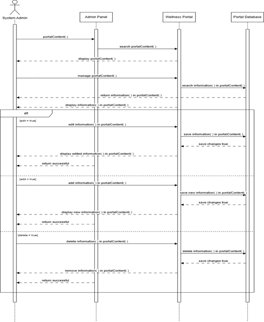

Figure 3.21 Manage Content Updates Sequence Diagram

## **3.2 Performance Requirements** {#performance-requirements}

**  
**This section specifies the performance expectations for the system,
including response times, data sync frequency, and concurrent user
capacity. These requirements ensure the system remains efficient and
reliable.

Table 3.2 Performance Requirement

| Requirement               | Description                                                                                           | Priority |
|---------------------------|-------------------------------------------------------------------------------------------------------|----------|
| System Responsiveness     | The platform shall respond to any booking or login request within 0 to 3 seconds.                     | High     |
| Appointment Sync          | The system shall sync appointment data with the medical software within 10 seconds.                   | Medium   |
| Notification Delivery     | Notification shall be sent to users within 30 seconds of being triggered.                             | Medium   |
| Data Load                 | Dashboards and timetables shall load within 2 seconds under normal load (≤ 500 users).                | High     |
| Concurrent Access         | The system shall support at least 1,000 concurrent student logins during peak hours without crashing. | High     |
| Search Speed              | The system shall return search results (e.g., available appointments/classes) within **2 seconds**.   | Medium   |
| Login Authentication Time | User login processing (including RBAC) shall complete within **1 second** under normal load.          | High     |
| Data Upload Time          | Staff shall be able to upload announcements or media files within **3 seconds**.                      | Medium   |
| API Response Time         | API calls to external fitness/medical systems shall return responses within **5 seconds**.            | Medium   |
| Load Time                 | The system shall maintain **≤ 5-second page loads** when accessed by **≥ 1000 users simultaneously**. | Medium   |

##   {#section-35}

## **3.3 Usability Requirements** {#usability-requirements}

**  
**This section focuses on the user experience of the system, including
ease of use, accessibility, and user interface design. These
requirements ensure that the portal is accessible, intuitive, and
effective for all user types.

Table 3.3 Usability Requirement

| **Requirement**              | **Description**                                                                                            | **Priority** |
|------------------------------|------------------------------------------------------------------------------------------------------------|--------------|
| Simple Navigation            | Users shall be able to access major functions (e.g., booking, goal setting) within three clicks.           | High         |
| Responsive Design            | The platform shall provide full functionality and readability across mobile phones, tablets, and desktops. | High         |
| Consistent Navigation Design | All pages shall maintain a consistent layout and navigation bar for ease of learning.                      | High         |
| Accessibility Support        | The UI shall comply with WCAG 2.1 AA to support users with visual or cognitive impairments.                | Medium       |
| Seamless Login               | The platform shall provide a seamless login experience with secure authentication.                         | High         |
| Error Feedback               | The system shall provide clear and helpful messages when users encounter errors during input.              | Medium       |
| Dashboard Clarity            | The student dashboard shall display upcoming appointments, goals, and classes **at a glance**.             | High         |
| Form Autofill Support        | Frequently entered fields (e.g., name, email) shall support browser-based autofill.                        | Medium       |
| Confirmation Feedback        | All user actions (e.g., booking, saving) shall display a **success or failure confirmation**.              | High         |
| Input Validation             | All input fields shall validate formats (e.g., email, dates) and display meaningful error messages.        | High         |
| User Customization Options   | Users shall be able to personalize dashboard widgets (e.g., hide/show goals).                              | Low          |

##   {#section-36}

## **3.4 Interface Requirements** {#interface-requirements}

### **3.4.1 System Interfaces** {#system-interfaces}

The Campus Wellness Portal will integrate with multiple university
systems to enable seamless coordination of health services, fitness
management, and student data exchange. Below is a detailed list of
critical system interfaces:

Table 3.4 System Interface Requirement

| Interface ID | System Name                | Description                                                   | Details                                                            |
|--------------|----------------------------|---------------------------------------------------------------|--------------------------------------------------------------------|
| REQ_SI001    | University Authentication  | Secure login for students/staff using university credentials. | Role-based access (RBAC) via student IDs/system admin credentials. |
| REQ_SI002    | Medical Software System    | Syncs appointments and medical records.                       | Encrypted data exchange                                            |
| REQ_SI003    | Fitness Software System    | Manages class bookings and schedules.                         | Real-time slot updates                                             |
| REQ_SI004    | Notification System        | Sends reminders (email/SMS) for appointments/classes.         | SMTP for emails                                                    |
| REQ_SI005    | Student Information System | Pulls student profiles (e.g., enrolment status).              | Read-only access                                                   |

###  {#section-37}

###   {#section-38}

###   {#section-39}

### **3.4.2 User Interfaces** {#user-interfaces}

Below are the key interface features between the Campus Wellness Portal
and its users, including medical staff, fitness coordinators, and
students. This covers design elements of the graphical user interface
(GUI) such as:

- Colour schemes

- Font families and sizing

- Interactive components

- Accessibility considerations

Table 3.5 User Interface Requirement

<table>
<colgroup>
<col style="width: 24%" />
<col style="width: 48%" />
<col style="width: 26%" />
</colgroup>
<thead>
<tr class="header">
<th>Module ID</th>
<th>Description</th>
<th>Priority</th>
</tr>
<tr class="odd">
<th>REQ_UI001</th>
<th>
Dashboard

colours: Primary blue (#2E5AAC) for headers, neutral white/ gray
background

Fonts: Open Sans (16px body, 20px headings)

Components: Collapsible sidebar, persistent top nav bar

Accessibility: AA contrast compliance, keyboard-navigable
menu
</th>
<th>High</th>
</tr>
<tr class="header">
<th>REQ_UI002</th>
<th>
Appointment Scheduling

colours<em>: Green success (#4CAF50), red urgency (#F44336)</em>

Fonts: Bold 14px labels, 12px helper text

Components: Date picker, symptom dropdowns, "Urgent" toggle

Accessibility: ARIA labels for screen readers, focus states
</th>
<th>High</th>
</tr>
<tr class="odd">
<th>REQ_UI003</th>
<th>
Fitness Class Booking

Colours: Activity-type tags (orange for yoga, purple for HIIT)

Fonts: 18px class titles, 12px capacity counters

Components: Filter chips, real-time availability badges

Accessibility: Motion reduction option for animations
</th>
<th>High</th>
</tr>
<tr class="header">
<th>REQ_UI004</th>
<th>
Goal Tracker

Colours: Progress gradients (blue 30% → green 100%)

Fonts: 16px input fields, 12px milestone notes

Components: Draggable sliders, achievement pop-ups

Accessibility: Text alternatives for charts
</th>
<th>Medium</th>
</tr>
<tr class="odd">
<th>REQ_UI005</th>
<th>
Medical Staff Admin Console

Colours: Clinical teal (#008080) for action buttons

Fonts: Monospace 13px for data entry (e.g., ICD codes)

Components: Encrypted field masks, bulk approval tools

Accessibility: High-contrast mode for low vision
</th>
<th>Medium</th>
</tr>
<tr class="header">
<th>REQ_UI006</th>
<th>
Admin Panel

Colours: Dark theme (#121212) with red alerts (#FF5252)

Fonts: 14px system logs, 16px role management

Components: Audit logs, granular permission toggles

Accessibility: Tab-indexed tables, reduced data density
option
</th>
<th></th>
</tr>
</thead>
<tbody>
</tbody>
</table>

###   {#section-40}

### **3.4.3 Hardware Interfaces** {#hardware-interfaces}

The Campus Wellness Portal is designed to function on both desktop and
mobile devices meeting the following specifications. Some features may
be limited or unavailable on devices that do not meet these
requirements:

Table 3.6 Hardware Interface Requirement

<table>
<colgroup>
<col style="width: 21%" />
<col style="width: 78%" />
</colgroup>
<thead>
<tr class="header">
<th>Interface ID</th>
<th>Description</th>
</tr>
<tr class="odd">
<th>REQ_HI001</th>
<th>
<strong>Minimum Requirements</strong>

<ul>
<li><blockquote>

Desktop: Modern browsers (Chrome/Firefox/Edge v90+, Safari v14+)

</blockquote></li>
<li><blockquote>

Mobile: iOS 13+ or Android 9+ with 2GB RAM

</blockquote></li>
<li><blockquote>

Screen: 320px minimum width (responsive layout)

</blockquote></li>
</ul></th>
</tr>
<tr class="header">
<th>REQ_HI002</th>
<th>
<strong>Feature Limitations</strong>

<ul>
<li><blockquote>

Older devices/browsers may experience:

</blockquote>
<ul>
<li><blockquote>

Reduced performance in real-time booking updates

</blockquote></li>
<li><blockquote>

Limited display of wellness progress charts

</blockquote></li>
<li><blockquote>

No offline functionality

</blockquote></li>
</ul></li>
</ul></th>
</tr>
<tr class="odd">
<th>REQ_HI003</th>
<th>
<strong>Recommended Specs</strong>

<ul>
<li><blockquote>

4G/LTE or Wi-Fi for media-rich content (e.g., workout videos)

</blockquote></li>
<li><blockquote>

WebGL support for interactive goal trackers

</blockquote></li>
</ul></th>
</tr>
</thead>
<tbody>
</tbody>
</table>

### **3.4.4 Software Interfaces** {#software-interfaces}

###  {#section-41}

The Campus Wellness Portal integrates with essential software platforms
to ensure cross-device accessibility and seamless functionality. Below
are the minimum system requirements for optimal performance, covering
operating systems, browsers, and database compatibility. Devices or
software versions not meeting these specifications may experience
limited feature availability.

Table 3.7 Software Interface Requirement

| ID         | Category          | Name       | Version                   | Purpose                                                          | Reference                           |
|------------|-------------------|------------|---------------------------|------------------------------------------------------------------|-------------------------------------|
| REQ_SIA001 | Operating System  | Windows    | 10 or later               | Supports portal access and manages hardware/software resources.  | University IT Standards             |
|            |                   | macOS      | Mojave 10.14 or later     | Ensures compatibility with Apple devices.                        | University IT Standards             |
|            |                   | Android    | 10 (Quince Tart) or later | Required for mobile access to fitness/medical features.          | Wellness Portal QA Testing          |
|            |                   | iOS        | 15.0 or later             | Optimized for iPhone/iPad usability.                             | Wellness Portal QA Testing          |
| REQ_SIA002 | Browser           | Chrome     | 124.0+                    | Primary supported browser for all portal features.               | Chrome Dev Documentation            |
|            |                   | Firefox    | 115.0+                    | Backup browser with full functionality.                          | Mozilla Compatibility Docs          |
|            |                   | Safari     | 16.6+                     | Ensures performance on macOS/iOS devices.                        | Apple Developer Guidelines          |
| REQ_SIA003 | Database          | PostgreSQL | 14.0+                     | Securely stores student health records and appointment data.     | HIPAA Compliance Documentation      |
| REQ_SIA004 | Mobile Resolution | N/A        | 320px minimum width       | Guarantees responsive design for all fitness/medical interfaces. | WCAG 2.1 AA Accessibility Standards |

### **3.4.5 Communication Interfaces** {#communication-interfaces}

Table 3.8 Communication Interface Requirement

| **Interface**                              | **Description**                                                                                                                                                  |
|--------------------------------------------|------------------------------------------------------------------------------------------------------------------------------------------------------------------|
| HTTPS (REST API)                           | Used for secure data exchange between the portal and external systems (e.g., medical, fitness). All API calls are made over HTTPS using standard REST protocols. |
| JSON Format                                | All request and response messages exchanged via APIs will be structured in JSON for consistency and ease of parsing.                                             |
| SMTP (Email Notifications)                 | The system will use SMTP to send email reminders and notifications to users (e.g., appointment confirmations).                                                   |
| Network Access Requirement                 | The system requires access to a secure university network or the internet to function properly. All sensitive communications must be encrypted.                  |
| Authentication Tokens                      | API communication will use OAuth 2.0 or session-based tokens for secure access between integrated systems.                                                       |
| Firewall and Port Settings                 | The system must be configured to allow HTTPS (port 443) and SMTP (port 587) traffic through the network firewall.                                                |
| WebSocket / Push Notification *(optional)* | May be used to deliver real-time announcements or reminders to students' dashboards.                                                                             |

###   {#section-42}

## **3.5 Logical Database Requirements** {#logical-database-requirements}

This section defines the key data entities and relationships that the
Campus Wellness Portal must store and manage. It provides a foundation
for the system's database design using entities, attributes, and
associations.

## 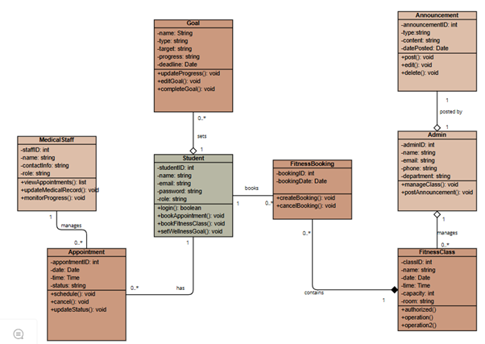 {#section-43}

Figure 3.5 Class Diagram (**NAMING PROBLEM**)

## **3.6 Design Constraints ** {#design-constraints}

This section will outline the design constraints and limitations that
are required to be considered throughout the process of the Campus
Wellness Portal with Medical System and Fitness Center Integration. The
design constraints and limitations stem from various sources such as
time constraints, budget constraints, regulatory and compliance
constraints, and so much more.

The following table attempts to list and explain the constraints for the
system.

Table 3.9 Design Constraints

| Requirement ID | Categories                                | Description                                                                                                               | Priority |
|----------------|-------------------------------------------|---------------------------------------------------------------------------------------------------------------------------|----------|
| REQ_DC001      | Budget                                    | The system must be developed within a budget of MYR100,000.                                                               | High     |
| REQ_DC002      | Data Storage                              | The system must store data on a university-approved server.                                                               | High     |
| REQ_DC003      | Integration                               | The system must integrate with existing university systems (Medical System and Fitness Center System).                    | High     |
| REQ_DC004      | Language and Localization                 | The system must support English.                                                                                          | High     |
| REQ_DC005      | Organizational                            | The system must adhere to the organization\'s visual identity. (Use of colour scheme, branding, design philosophy, etc.). | Low      |
| REQ_DC006      | Performance                               | The system must be optimized for commonly used browsers.                                                                  | High     |
| REQ_DC007      |                                           | The system must have a modular architecture to ensure scalability.                                                        | High     |
| REQ_DC008      |                                           | The system must be designed to minimize server load and processing time.                                                  | Medium   |
| REQ_DC009      | Regulatory and Compliance (Accessibility) | The system must be designed in compliance to the Web Content Accessibility Guidelines (WCAG).                             | High     |
| REQ_DC010      | Regulatory and Compliance (Healthcare)    | The system must follow the Health Insurance Portability and Accountability Act (HIPAA).                                   | High     |
| REQ_DC011      | Regulatory and Compliance (Privacy)       | The system must follow Malaysia\'s Personal Data Protection Act 2010 (PDPA).                                              | High     |
| REQ_DC012      | Security                                  | The system must only allow personnels with authorization to access.                                                       | High     |
| REQ_DC013      | Social and Cultural                       | The system must not contain or display any offensive or graphic material.                                                 | High     |
| REQ_DC014      | Technological Stack                       | The system must use open-source libraries and frameworks supported by the organization .                                  | Medium   |
| REQ_DC015      | Time                                      | The system must be developed within a period of 2-years.                                                                  | High     |

## **3.7 Software System Attributes** {#software-system-attributes}

This section will discuss and specify the desired capabilities,
performances, and characteristics of Campus Wellness Portal with Medical
System and Fitness Center Integration. These attributes are what the
Campus Wellness Portal with Medical System and Fitness Center
Integration should display when development is finalised.

The following subsections attempts to explain and elaborate each
attribute and what the system must achieve to meet those attributes.

Table 3.10 Software System Attributes

| Attribute       | Requirement ID | Description                                                                                                                                      | Priority |
|-----------------|----------------|--------------------------------------------------------------------------------------------------------------------------------------------------|----------|
| Usability       | REQ_SRA001     | The portal shall provide a user-friendly and intuitive interface without any in-depth technical background.                                      | High     |
|                 | REQ_SRA002     | The portal shall maintain a consistent UI design throughout its interface.                                                                       | High     |
| Accuracy        | REQ_SRA003     | The system shall have a maximum error rate of 0.001%.                                                                                            | High     |
| Availability    | REQ_SRA004     | The system shall be available to use every semester excluding semester break and public holidays.                                                | High     |
| Reliability     | REQ_SRA005     | The system shall handle at least 10,000 users without crashing.                                                                                  | High     |
|                 | REQ_SRA006     | The portal shall send notifications for each success or failure of operations to the user.                                                       | High     |
|                 | REQ_SRA007     | The system shall record all operations to maintain accurate records.                                                                             | High     |
| Security        | REQ_SRA008     | The portal shall only allow authorised users, (i.e. students with ID) to access.                                                                 | High     |
|                 | REQ_SRA009     | The system shall protect its data against unauthorised access.                                                                                   | High     |
|                 | REQ_SRA010     | The system shall employ data encryption to safeguard data.                                                                                       | High     |
|                 | REQ_SRA011     | The system shall release patches and updates regularly to address vulnerabilities.                                                               | Medium   |
|                 | REQ_SRA012     | The system shall utilise a firewall to protect against unauthorised access.                                                                      | High     |
|                 | REQ_SRA013     | The system shall backup its data regularly in case of a breach.                                                                                  | High     |
|                 | REQ_SRA014     | The system shall be regularly tested and audited to verify its safety.                                                                           | Medium   |
|                 | REQ_SRA015     | The system shall provide security training for development teams.                                                                                | Medium   |
|                 | REQ_SRA016     | The system shall implement multi-factor authentication (MFA).                                                                                    | High     |
|                 | REQ_SRA017     | The system shall follow the General Data Protection Regulations (GDPR).                                                                          | High     |
| Maintainability | REQ_SRA018     | The system shall be developed using the Scrum method.                                                                                            | High     |
|                 | REQ_SRA019     | The codebase shall be well-documented and thoroughly explain each interface within the system.                                                   | High     |
|                 | REQ_SRA020     | The code shall be divided into cohesional functional segments.                                                                                   | High     |
|                 | REQ_SRA021     | The codebase shall be logged and managed under version control (i.e. Git).                                                                       | High     |
|                 | REQ_SRA022     | The code shall be written with design pattern in mind (i.e. MVC Model).                                                                          | High     |
|                 | REQ_SRA023     | The system shall conduct code reviews regularly to avoid inconsistency.                                                                          | High     |
|                 | REQ_SRA024     | The system shall be built with a modular architecture.                                                                                           | High     |
|                 | REQ_SRA025     | The codebase shall adapt Test-Driven Deployment (TTD) to help in troubleshooting issues.                                                         | High     |
|                 | REQ_SRA026     | The codebase shall be written in a consistent manner to make it as readable as possible.                                                         | High     |
|                 | REQ_SRA027     | The codebase shall be backwards compatible with previous versions for at least a year.                                                           | High     |
|                 | REQ_SRA028     | The portal shall be modular to support upgrades and new features without affecting existing functions.                                           | High     |
| Portability     | REQ_SRA029     | The portal shall be accessible on various operating systems, such as, Windows, macOS, Linux, Android, and iOS.                                   | High     |
|                 | REQ_SRA030     | The portal shall at least be compatible with commonly used web browsers, such as Google Chrome, FireFox, Microsoft Edge, Safari, Opera, and Tor. | High     |

##   {#section-44}

## **3.8 Supporting Information** {#supporting-information}

This section will provide additional information to act as the system's
requirements. Results and information gathered from the elicitation
period will be included.

Throughout the elicitation period, multiple elicitations method has been
conducted to further grasp the requirements expected for the entire
system. The elicitation method that had been carried out are as follows:

1.  **Brainstorming** - We had conducted brainstorming sessions to
    > create ideas and elicit requirements for Campus Wellness Portal
    > with Medical System and Fitness Center Integration.

2.  **Questionnaire** - We had created questionnaires for relevant
    > stakeholders to gather their opinions and to solidify requirements
    > on Campus Wellness Portal with Medical System and Fitness Center
    > Integration.

3.  **Interview** - We had conducted interview sessions with relevant
    > stakeholders to acquire detailed description of functions
    > experiences.

**3.8.1 Brainstorming:  
** **  
**Following are descriptions of what each brainstorming session
discussed:

<table>
<colgroup>
<col style="width: 25%" />
<col style="width: 74%" />
</colgroup>
<thead>
<tr class="header">
<th colspan="2"><strong>Brainstorming session #1</strong></th>
</tr>
<tr class="odd">
<th><strong>Identifier</strong></th>
<th>REQ_BS001</th>
</tr>
<tr class="header">
<th><strong>Title</strong></th>
<th>Project Vision</th>
</tr>
<tr class="odd">
<th><strong>Date</strong></th>
<th>30th April 2025, 10:00 - 12:00</th>
</tr>
<tr class="header">
<th><strong>Participants</strong></th>
<th>
Tham Yong Shian

Ahmad Farhan Zikri Bin Ahmad Fara

Mohammad Ammarul Azim Bin Mohamad Yusof
</th>
</tr>
<tr class="odd">
<th><strong>Goals/Issues</strong></th>
<th>Discuss about the project vision, scopes and goals.</th>
</tr>
<tr class="header">
<th><strong>Results</strong></th>
<th><table>
<colgroup>
<col style="width: 33%" />
<col style="width: 33%" />
<col style="width: 33%" />
</colgroup>
<thead>
<tr class="header">
<th colspan="3"><strong>Project Vision:</strong> To achieve a system to
streamline and convenience a student’s health and wellness</th>
</tr>
<tr class="odd">
<th><strong>Project Scope</strong></th>
<th colspan="2"><ul>
<li><blockquote>

Integration with the university healthcare system

</blockquote>
<ul>
<li><blockquote>

Schedule appointments for medical services.

</blockquote></li>
<li><blockquote>

View and keep tabs of personal medical history.

</blockquote></li>
<li><blockquote>

Receive notifications for upcoming reservations.

</blockquote></li>
</ul></li>
<li><blockquote>

Integration with the campus recreation facility management
software

</blockquote>
<ul>
<li><blockquote>

Book and retain time slots for recreational purposes.

</blockquote></li>
<li><blockquote>

View timetable for weekly exercises.

</blockquote></li>
<li><blockquote>

Avoid conflict between class schedule and workout time.

</blockquote></li>
</ul></li>
<li><blockquote>

Personal Wellness Management

</blockquote>
<ul>
<li><blockquote>

Set personal wellness goals and performances.

</blockquote></li>
<li><blockquote>

Progress tracking of previous and future activities.

</blockquote></li>
<li><blockquote>

Track your schedule outside of exercising. (e.g., sleeping, stress
management, mealtime)

</blockquote></li>
</ul></li>
<li><blockquote>

Tailored Health Resources

</blockquote>
<ul>
<li><blockquote>

Receive personalised health advice and recommendations.

</blockquote></li>
<li><blockquote>

Access various educational materials for a healthy lifestyle.

</blockquote></li>
<li><blockquote>

Enjoy personalised content to watch or listen to, (e.g., meal preps,
workout music, types of exercise)

</blockquote></li>
</ul></li>
</ul></th>
</tr>
<tr class="header">
<th><strong>Project Goal</strong></th>
<th colspan="2"><ul>
<li><blockquote>

Centralize access to campus wellness services in a single
platform.

</blockquote></li>
<li><blockquote>

Encourage students to take the initiative to achieve a better
lifestyle.

</blockquote></li>
<li><blockquote>

Facilitate the process of booking and making an appointment.

</blockquote></li>
<li><blockquote>

Reduce the conflicts between study schedules and free time
activities.

</blockquote></li>
<li><blockquote>

Cultivate a healthy habit that includes fitness, diet, and
stress-free living.

</blockquote></li>
</ul></th>
</tr>
</thead>
<tbody>
</tbody>
</table></th>
</tr>
</thead>
<tbody>
</tbody>
</table>

<table>
<colgroup>
<col style="width: 25%" />
<col style="width: 74%" />
</colgroup>
<thead>
<tr class="header">
<th colspan="2"><strong>Brainstorming session #2</strong></th>
</tr>
<tr class="odd">
<th><strong>Identifier</strong></th>
<th>REQ_BS002</th>
</tr>
<tr class="header">
<th><strong>Title</strong></th>
<th>Stakeholders and Elaboration</th>
</tr>
<tr class="odd">
<th><strong>Date</strong></th>
<th>1st May 2025, 16:00 - 18:00</th>
</tr>
<tr class="header">
<th><strong>Participants</strong></th>
<th>
Tham Yong Shian

Ahmad Farhan Zikri Bin Ahmad Fara

Mohammad Ammarul Azim Bin Mohamad Yusof
</th>
</tr>
<tr class="odd">
<th><strong>Goals/Issues</strong></th>
<th>Identify stakeholders, their interest and impact to the system.</th>
</tr>
<tr class="header">
<th><strong>Results</strong></th>
<th><table>
<colgroup>
<col style="width: 33%" />
<col style="width: 33%" />
<col style="width: 33%" />
</colgroup>
<thead>
<tr class="header">
<th><strong>Stakeholder</strong></th>
<th><strong>Interest</strong></th>
<th><strong>Impact</strong></th>
</tr>
<tr class="odd">
<th>Student</th>
<th>
The end user for the system.

As the primary user, they have an interest in ensuring that the
system performs the required functionalities for the user to be able to
perform their operations.
</th>
<th>The entire system is built around their convenience and involvement.
The usability of the system and feature design are all shaped according
to their interest and feedback.</th>
</tr>
<tr class="header">
<th>Medical Staff</th>
<th>The medical staff has an interest in managing the health of the
students.</th>
<th>The system should incorporate their workflow to avoid any
unnecessary complication.</th>
</tr>
<tr class="odd">
<th>IT Support Unit</th>
<th>The IT Support unit has an interest in ensuring the system can be
supportable by the organization and that all artifacts delivered will be
usable and accurately reflect the procedures necessary to be supported
by the system’s resources.</th>
<th>Must help in implementing the system's backend and database.</th>
</tr>
<tr class="header">
<th>Fitness Coordinator</th>
<th>The fitness coordinator has an interest in managing the physicality
of the students.</th>
<th>The system should incorporate their workflow to avoid any
unnecessary complication.</th>
</tr>
<tr class="odd">
<th>System Admin</th>
<th>The system admin has an interest in ensuring the system’s cost,
schedule, quality, risks and issues are carefully monitored, managed and
that newer implementations of functionality be approved.</th>
<th>The system must comply with the admin's visions, missions, and terms
and conditions to drive operational priorities.</th>
</tr>
</thead>
<tbody>
</tbody>
</table></th>
</tr>
</thead>
<tbody>
</tbody>
</table>

<table>
<colgroup>
<col style="width: 25%" />
<col style="width: 74%" />
</colgroup>
<thead>
<tr class="header">
<th colspan="2"><strong>Brainstorming session #3</strong></th>
</tr>
<tr class="odd">
<th><strong>Identifier</strong></th>
<th>REQ_BS003</th>
</tr>
<tr class="header">
<th><strong>Title</strong></th>
<th>System Actors and Use Cases</th>
</tr>
<tr class="odd">
<th><strong>Date</strong></th>
<th>8th May 2025, 14:00 - 16:00</th>
</tr>
<tr class="header">
<th><strong>Participants</strong></th>
<th>
Tham Yong Shian

Ahmad Farhan Zikri Bin Ahmad Fara

Mohammad Ammarul Azim Bin Mohamad Yusof
</th>
</tr>
<tr class="odd">
<th><strong>Goals/Issues</strong></th>
<th>List the various use cases and the functional operations that
stakeholders should operate with.</th>
</tr>
<tr class="header">
<th><strong>Results</strong></th>
<th><table>
<colgroup>
<col style="width: 50%" />
<col style="width: 50%" />
</colgroup>
<thead>
<tr class="header">
<th><strong>Actors</strong></th>
<th><strong>Use Cases</strong></th>
</tr>
<tr class="odd">
<th>Student</th>
<th><ul>
<li><blockquote>

Login

</blockquote></li>
<li><blockquote>

Register

</blockquote></li>
<li><blockquote>

Schedule Appointment

</blockquote></li>
<li><blockquote>

Book Fitness Class

</blockquote></li>
<li><blockquote>

Set Goal

</blockquote></li>
<li><blockquote>

View Timetable

</blockquote></li>
<li><blockquote>

Watch Content

</blockquote></li>
<li><blockquote>

View Health Advice

</blockquote></li>
<li><blockquote>

Access Online Chat

</blockquote></li>
<li><blockquote>

Submit Feedback

</blockquote></li>
</ul></th>
</tr>
<tr class="header">
<th>Medical Staff</th>
<th><ul>
<li><blockquote>

Login

</blockquote></li>
<li><blockquote>

Register

</blockquote></li>
<li><blockquote>

Manage Appointment

</blockquote></li>
<li><blockquote>

Manage Medical Record

</blockquote></li>
<li><blockquote>

Send Health Advice]

</blockquote></li>
<li><blockquote>

Monitor Student Progress

</blockquote></li>
<li><blockquote>

Post Media

</blockquote></li>
<li><blockquote>

Access Online Chat

</blockquote></li>
</ul></th>
</tr>
<tr class="odd">
<th>Fitness Coordinator</th>
<th><ul>
<li><blockquote>

Login

</blockquote></li>
<li><blockquote>

Register

</blockquote></li>
<li><blockquote>

Assign Activities

</blockquote></li>
<li><blockquote>

Manage Fitness Class Booking

</blockquote></li>
<li><blockquote>

Add Fitness Class

</blockquote></li>
<li><blockquote>

Post Media

</blockquote></li>
</ul></th>
</tr>
<tr class="header">
<th>System Admin</th>
<th><ul>
<li><blockquote>

Login

</blockquote></li>
<li><blockquote>

Manage User Account

</blockquote></li>
<li><blockquote>

Monitor System Performance

</blockquote></li>
<li><blockquote>

Manage Content Updates

</blockquote></li>
</ul></th>
</tr>
</thead>
<tbody>
</tbody>
</table></th>
</tr>
</thead>
<tbody>
</tbody>
</table>

<table>
<colgroup>
<col style="width: 25%" />
<col style="width: 74%" />
</colgroup>
<thead>
<tr class="header">
<th colspan="2"><strong>Brainstorming session #4</strong></th>
</tr>
<tr class="odd">
<th><strong>Identifier</strong></th>
<th>REQ_BS004</th>
</tr>
<tr class="header">
<th><strong>Title</strong></th>
<th>System Admin Elicitation</th>
</tr>
<tr class="odd">
<th><strong>Date</strong></th>
<th>15th May 2025, 13:00 - 14:00</th>
</tr>
<tr class="header">
<th><strong>Participants</strong></th>
<th>
Tham Yong Shian

Ahmad Farhan Zikri Bin Ahmad Fara

Mohammad Ammarul Azim Bin Mohamad Yusof
</th>
</tr>
<tr class="odd">
<th><strong>Goals/Issues</strong></th>
<th>Elicit requirements for system admin stakeholder.</th>
</tr>
<tr class="header">
<th><strong>Results</strong></th>
<th><table>
<colgroup>
<col style="width: 33%" />
<col style="width: 33%" />
<col style="width: 33%" />
</colgroup>
<thead>
<tr class="header">
<th><strong>Requirement</strong></th>
<th><strong>Category</strong></th>
<th><strong>Reasoning</strong></th>
</tr>
<tr class="odd">
<th>Login using special identifier</th>
<th>Dissatisfier</th>
<th>Mandatory for security reasons</th>
</tr>
<tr class="header">
<th>Provides documentation for admin</th>
<th>Satisfier</th>
<th>Streamline admin operation</th>
</tr>
<tr class="odd">
<th>Provides admin panel</th>
<th>Satisfier</th>
<th>Optimise monitoring</th>
</tr>
</thead>
<tbody>
</tbody>
</table></th>
</tr>
</thead>
<tbody>
</tbody>
</table>

**3.8.2 Questionnaire:**

**Requirement 1: Login with ID / credentials**

The question was aimed to gather feedback from users (student
stakeholder) regarding the option to login using their ID/credentials.
From both the pie charts provided, it is obvious that a majority of
users expected the feature to be added. However, the consensus on the
absence of the feature is conflicted, having only the "I can manage with
the feature" pie chart winning over a small percentage.

**Requirement 2: Schedule appointment with medical staff**

The question was aimed to gather feedback from users (student
stakeholder) regarding the option to schedule an appointment with a
medical staff. From both the pie charts provided, it is obvious that a
majority of users expected the feature to be added and a majority of
users can tolerate having the feature be absent.

**Requirement 3: Book fitness class from fitness coordinator**

The question was aimed to gather feedback from users (student
stakeholder) regarding the option to book a fitness class. From both the
pie charts provided, it is obvious that a majority of users expected the
feature to be added and a majority of users are neutral about having the
feature be absent.

**Requirement 4: View upcoming activities**

The question was aimed to gather feedback from users (student
stakeholder) regarding the option to view upcoming and previous
appointments. From both the pie charts provided, it is surprising to see
users who like the feature to win over a slight margin. On the other
hand, users who dislike the absence of said feature as well as users who
can tolerate the absence of said feature to be tied.

**Requirement 5: Set and track personal goal**

The question was aimed to gather feedback from users (student
stakeholder) regarding the option to set and track personal goals. From
both the pie charts provided, it is obvious that a majority of users
would like the feature to be added and a majority of users are neutral
about having the feature be absent.

**Requirement 6: Receive personalized health content**

The question was aimed to gather feedback from users (student
stakeholder) regarding the option to receive personal health content.
From both the pie charts provided, it is obvious that a majority of
users would like the feature to be added and a majority of users are
neutral about having the feature be absent.

**Requirement 7: Watch personalized media content**

The question was aimed to gather feedback from users (student
stakeholder) regarding the option to watch and enjoy personalized media
content. From both the pie charts provided, it is obvious that a
majority of users would like the feature to be added. On the other hand,
it was surprising to see users be conflicted on either tolerating or
neutral about the absence of said feature.

**Requirement 8: Chat with online support**

The question was aimed to gather feedback from users (student
stakeholder) regarding the option to chat with online support. From both
the pie charts provided, it is shocking to see users conflicted on
either liking or expecting the feature. Same goes for the absence of the
feature, where users are conflicted on either disliking or neutral.

**Requirement 9: Receive notification and reminder**

The question was aimed to gather feedback from users (student
stakeholder) regarding the option to receive notifications and reminders
of upcoming activities. From both the pie charts provided, it is
shocking to see users conflicted on either liking or expecting the
feature. However, it is clear that users dislike the absence of
receiving any notifications.

**Requirement 10: Search for free time slot**

The question was aimed to gather feedback from users (student
stakeholder) regarding the option to search for free time slots. From
both the pie charts provided, it is shocking to see users conflicted on
either liking or expecting the feature. However, it is clear that users
dislike the absence of receiving any notifications.

**Requirement 11: Submit user feedback**

The question was aimed to gather feedback from users (student
stakeholder) regarding the option to submit user feedback. From both the
pie charts provided, it is shocking to see the options on either liking
or expecting the feature would be a tie. However, it is clear that users
are neutral to the absence of receiving any notifications.

**3.8.3 Interview:**

**Interview Session \#1**

<table>
<colgroup>
<col style="width: 17%" />
<col style="width: 82%" />
</colgroup>
<thead>
<tr class="header">
<th>Identifier</th>
<th>REQ_INT001</th>
</tr>
<tr class="odd">
<th>Date</th>
<th>23.05.2025</th>
</tr>
<tr class="header">
<th>Goal</th>
<th>Elicitation of requirements for the medical staff stakeholder in
Campus Wellness Portal with Medical System and Fitness Center
Integration.</th>
</tr>
<tr class="odd">
<th>Interviewer</th>
<th>Tham Yong Shian</th>
</tr>
<tr class="header">
<th>Interviewee(s)</th>
<th>Tan Kok Tong (Intern Pharmacist, ALPRO Pharmacy Semenyih Taman
Pelangi)</th>
</tr>
<tr class="odd">
<th>Minutes</th>
<th><ul>
<li><blockquote>

Is fine with using ID/credentials to login and access the portal if
the ID isn’t connected to personal information and there’s 2FA.

</blockquote></li>
<li><blockquote>

Can manage with the feature of managing appointments, suggested to
add a reasoning when denying an appointment.

</blockquote></li>
<li><blockquote>

Would love to see upcoming event notifications and reminders.

</blockquote></li>
<li><blockquote>

Love the idea of monitoring student’s health progress if given a way
to encrypt said data.

</blockquote></li>
<li><blockquote>

Dislike the idea of giving health advice since it’s always general
advice that is given commonly.

</blockquote></li>
<li><blockquote>

Love the idea of assessing and monitoring student health records if
given a way to encrypt said data.

</blockquote></li>
<li><blockquote>

Love the idea of online chat support but it is discouraged since
medical staff are busy.

</blockquote></li>
<li><blockquote>

Love the idea but it is discouraged since medical staff are busy and
there’s a difference in perspective amongst the classes.

</blockquote></li>
</ul></th>
</tr>
</thead>
<tbody>
</tbody>
</table>

**Interview Session \#2**

<table>
<colgroup>
<col style="width: 17%" />
<col style="width: 82%" />
</colgroup>
<thead>
<tr class="header">
<th>Identifier</th>
<th>REQ_INT002</th>
</tr>
<tr class="odd">
<th>Date</th>
<th>23.05.2025</th>
</tr>
<tr class="header">
<th>Goal</th>
<th>Elicitation of requirements for the medical staff stakeholder in
Campus Wellness Portal with Medical System and Fitness Center
Integration.</th>
</tr>
<tr class="odd">
<th>Interviewer</th>
<th>Tham Yong Shian</th>
</tr>
<tr class="header">
<th>Interviewee(s)</th>
<th>Mieko (Intern Nurse, Ivoris Medical Clinic and Ivoris Dental
Clinic)</th>
</tr>
<tr class="odd">
<th>Minutes</th>
<th><ul>
<li><blockquote>

Deems using an ID for login is necessary.

</blockquote></li>
<li><blockquote>

Believed it is necessary to manage student’s appointments, suggested
adding a reason for declining appointments.

</blockquote></li>
<li><blockquote>

The function to see upcoming event notifications and reminders is a
requirement.

</blockquote></li>
<li><blockquote>

Is neutral on the ability to monitor student’s progress.

</blockquote></li>
<li><blockquote>

Assume it is necessary to give advice in order to help students.

</blockquote></li>
<li><blockquote>

The function of assessing and monitoring student health records is
necessary.

</blockquote></li>
<li><blockquote>

Doesn’t want the function of online chat support since they are
usually busy with their schedules.

</blockquote></li>
<li><blockquote>

Doesn’t want the function of posting media since it is hard to
interest students by only posting content.

</blockquote></li>
</ul></th>
</tr>
</thead>
<tbody>
</tbody>
</table>

**Interview Session \#3**

<table>
<colgroup>
<col style="width: 17%" />
<col style="width: 82%" />
</colgroup>
<thead>
<tr class="header">
<th>Identifier</th>
<th>REQ_INT003</th>
</tr>
<tr class="odd">
<th>Date</th>
<th>23.05.2025</th>
</tr>
<tr class="header">
<th>Goal</th>
<th>Elicitation of requirements for the fitness coordinator stakeholder
in Campus Wellness Portal with Medical System and Fitness Center
Integration.</th>
</tr>
<tr class="odd">
<th>Interviewer</th>
<th>Tham Yong Shian</th>
</tr>
<tr class="header">
<th>Interviewee(s)</th>
<th>Dyson Hong (Volleyball Coach, Grace Volleyball Academy)</th>
</tr>
<tr class="odd">
<th>Minutes</th>
<th><ul>
<li><blockquote>

Using ID to login is absolute.

</blockquote></li>
<li><blockquote>

Think it is a good addition to add fitness classes but don't think
it’s a requirement.

</blockquote></li>
<li><blockquote>

The ability to assign activities is sufficient.

</blockquote></li>
<li><blockquote>

It is reasonable to deny booking if classes are full.

</blockquote></li>
<li><blockquote>

Upload and post media is a good addition as it promotes students to
do sport.

</blockquote></li>
</ul></th>
</tr>
</thead>
<tbody>
</tbody>
</table>

**Interview Session \#4**

<table>
<colgroup>
<col style="width: 17%" />
<col style="width: 82%" />
</colgroup>
<thead>
<tr class="header">
<th>Identifier</th>
<th>REQ_INT004</th>
</tr>
<tr class="odd">
<th>Date</th>
<th>23.05.2025</th>
</tr>
<tr class="header">
<th>Goal</th>
<th>Elicitation of requirements for the fitness coordinator stakeholder
in Campus Wellness Portal with Medical System and Fitness Center
Integration.</th>
</tr>
<tr class="odd">
<th>Interviewer</th>
<th>Tham Yong Shian</th>
</tr>
<tr class="header">
<th>Interviewee(s)</th>
<th>Kenny Liu Boh Yong (Badminton Trainer, Sungai Chua Food &amp; Sports
Centre)</th>
</tr>
<tr class="odd">
<th>Minutes</th>
<th><ul>
<li><blockquote>

Login with ID is essential for easy identification for the
university.

</blockquote></li>
<li><blockquote>

Think it is necessary to add fitness classes for student’s health and
study balance.

</blockquote></li>
<li><blockquote>

Don't think it’s required to assign activities to provide students
with freedom.

</blockquote></li>
<li><blockquote>

Approving / denying booking isn’t needed to allow students to
participate in sport.

</blockquote></li>
<li><blockquote>

Love the idea of posting media for students as they are all on social
media nowadays.

</blockquote></li>
</ul></th>
</tr>
</thead>
<tbody>
</tbody>
</table>

#   {#section-45}

# **4. Verification** {#verification}

## **4.1 Verification Approach** {#verification-approach}

This section attempts to provide planned verification approaches and
methods for testing the qualities of the software of the Campus Wellness
Portal with Medical System and Fitness Center Integration. The
verification approaches are organized into a table form with the
included details by answering the questions of "How, Who, When, and
Where".

Table 4.1 Verification Approach

<table style="width:100%;">
<colgroup>
<col style="width: 16%" />
<col style="width: 16%" />
<col style="width: 16%" />
<col style="width: 16%" />
<col style="width: 16%" />
<col style="width: 16%" />
</colgroup>
<thead>
<tr class="header">
<th>Classificatio-ns</th>
<th>Requirement ID</th>
<th>Method (How)</th>
<th>Responsible Party (Who)</th>
<th>Timing (When)</th>
<th>Location (Where)</th>
</tr>
<tr class="odd">
<th rowspan="4">Functional</th>
<th>REQ_VA001</th>
<th>Unit testing</th>
<th>QA Team</th>
<th>After each module is added.</th>
<th>QA Lab</th>
</tr>
<tr class="header">
<th>REQ_VA002</th>
<th>Functional testing</th>
<th>QA Team and Software Developers Team</th>
<th>After unit testing.</th>
<th>QA Lab</th>
</tr>
<tr class="odd">
<th>REQ_VA003</th>
<th>System integration testing</th>
<th>QA Team</th>
<th>After integration of system modules.</th>
<th>QA Lab</th>
</tr>
<tr class="header">
<th>REQ_VA004</th>
<th>Review and finalisation</th>
<th>Product Team</th>
<th>Upon completion of functional operations.</th>
<th>Virtual meetings, code commit / pulling repository</th>
</tr>
<tr class="odd">
<th rowspan="4">Performance</th>
<th>REQ_VA005</th>
<th>Load Testing</th>
<th>Performance Team</th>
<th>Before deploying to production.</th>
<th>Staging Environment</th>
</tr>
<tr class="header">
<th>REQ_VA006</th>
<th>Stress Testing</th>
<th>Performance Team</th>
<th>Before deploying to production.</th>
<th>Staging Environment</th>
</tr>
<tr class="odd">
<th>REQ_VA007</th>
<th>User Acceptance Testing (UAT)</th>
<th>Volunteering End-Users</th>
<th>Pre-released.</th>
<th>Testing Environment/ Sandbox</th>
</tr>
<tr class="header">
<th>REQ_VA008</th>
<th>Performance Profiling</th>
<th>Performance Team</th>
<th>After functional testing.</th>
<th>Performance Lab</th>
</tr>
<tr class="odd">
<th rowspan="4">Security</th>
<th>REQ_VA009</th>
<th>Penetration Testing</th>
<th>External Vendor</th>
<th>Before deploying to production.</th>
<th>Staging Environment</th>
</tr>
<tr class="header">
<th>REQ_VA010</th>
<th>Risk Assessment</th>
<th>Test Analyst</th>
<th>During the development cycle.</th>
<th>Virtual meetings, code commit / pulling repository</th>
</tr>
<tr class="odd">
<th>REQ_VA011</th>
<th>Security Audit</th>
<th>Security Team</th>
<th>After system integration.</th>
<th>Security Lab</th>
</tr>
<tr class="header">
<th>REQ_VA012</th>
<th>Ethical Hacking</th>
<th>External Vendor</th>
<th>Before deploying to production.</th>
<th>Staging Environment</th>
</tr>
<tr class="odd">
<th rowspan="3">Usability</th>
<th>REQ_VA013</th>
<th>Lab Usability Testing</th>
<th>UX Team</th>
<th>Testing prototypes.</th>
<th>Usability Lab</th>
</tr>
<tr class="header">
<th>REQ_VA014</th>
<th>
Guerilla

Usability Testing
</th>
<th>UX Team</th>
<th>Design process.</th>
<th>Usability Lab</th>
</tr>
<tr class="odd">
<th>REQ_VA015</th>
<th>A/B Usability Testing</th>
<th>Volunteering End-Users</th>
<th>Pre-release.</th>
<th>Testing Environment/ Sandbox</th>
</tr>
<tr class="header">
<th rowspan="2">Maintainabi-lity</th>
<th>REQ_VA016</th>
<th>Code Review</th>
<th>Software Developers Team</th>
<th>During development cycle</th>
<th>Virtual meetings, code commit / pulling repository</th>
</tr>
<tr class="odd">
<th>REQ_VA017</th>
<th>Version Control</th>
<th>QA Team</th>
<th>Ongoing</th>
<th>Version Control System</th>
</tr>
<tr class="header">
<th rowspan="2">Portability</th>
<th>REQ_VA018</th>
<th>Browser- compatibility Testing</th>
<th>QA Team</th>
<th>Before deployment</th>
<th>Various commonly used browsers</th>
</tr>
<tr class="odd">
<th>REQ_VA019</th>
<th>Adaptability Testing</th>
<th>QA Team</th>
<th>Before deployment</th>
<th>Various OS setups</th>
</tr>
</thead>
<tbody>
</tbody>
</table>

## **4.2 Verification Criteria** {#verification-criteria}

This section attempts to explain the criteria in which to verify and to
test the quality of the verification approaches mentioned.

Following is an organized table specifying the conditions that the
system must achieved to be considered acceptable.

Table 4.2 Verification Criteria

| **Requirement Identifier** | **Verification Criteria**                                                                                          |
|----------------------------|--------------------------------------------------------------------------------------------------------------------|
| REQ_VA001                  | All modules must return correct outputs for valid inputs and handle invalid inputs gracefully.                     |
| REQ_VA002                  | The user should be able to schedule an appointment and receive confirmation successfully.                          |
| REQ_VA003                  | All integrated modules (e.g., health and fitness systems) must communicate and exchange data without error.        |
| REQ_VA004                  | 100% of use cases must be implemented and pass QA approval for functionality before final review.                  |
| REQ_VA005                  | The system must support 100,000 concurrent users with no significant degradation in performance.                   |
| REQ_VA006                  | The system must fail gracefully under extreme load, maintaining data integrity.                                    |
| REQ_VA007                  | At least 90% of test users should report satisfaction with the platform\'s performance during UAT.                 |
| REQ_VA008                  | The response time for a search query (e.g., finding a free fitness slot) should be \< 3 seconds under normal load. |
| REQ_VA009                  | No critical vulnerabilities should be found during testing.                                                        |
| REQ_VA010                  | All identified security risks must be categorized and mitigated with defined actions.                              |
| REQ_VA011                  | Access control must enforce role-based restrictions with 100% accuracy.                                            |
| REQ_VA012                  | The system must detect and log unauthorized access attempts in real-time.                                          |
| REQ_VA013                  | At least 85% of participants should complete key tasks (e.g., book an appointment) without assistance.             |
| REQ_VA014                  | Usability flaws should be identified and resolved in early prototypes based on participant feedback.               |
| REQ_VA015                  | The chosen design (A or B) should result in at least 10% higher task success rate or efficiency.                   |
| REQ_VA016                  | 100% of new code must pass peer review for readability, efficiency, and standards compliance.                      |
| REQ_VA017                  | All changes must be committed with clear messages and follow branch/tag conventions.                               |
| REQ_VA018                  | The platform must render and function correctly on Chrome, Firefox, Edge, and Safari (latest two versions).        |
| REQ_VA019                  | The system must install and run properly on Windows, macOS, and Linux OS environments.                             |

# **5. Appendices** {#appendices}

## **5.1 Assumptions and Dependencies** {#assumptions-and-dependencies}

Assumption and dependencies analysis is used to identify limitations and
potential areas of risk in projects or processes. It involves close
examination of all key assumptions made by the project and its
stakeholders.

Following are the results for the assumptions and dependencies.

**5.1.1 Assumptions**

These are conditions believed to be true for the project to proceed
smoothly:

Table 5.1 Assumptions

| **Assumption**                         | **Description**                                                                                      |
|----------------------------------------|------------------------------------------------------------------------------------------------------|
| Student Participation                  | Students will regularly login and actively use the platform to manage their wellness activities.     |
| System Integration Cooperation         | The university's health center and campus recreational facility will provide needed data access.     |
| Internet Access                        | Users have reliable internet access to use the platform.                                             |
| Health and Fitness Staff Collaboration | Medical and fitness staff are willing to update content and interact with students via the platform. |
| University IT Support                  | University IT services will support backend configuration.                                           |

**  
  
5.1.2 Dependencies  
**These are conditions believed to be true for the project to function
properly:**  
**

Table 5.2 Dependencies

| **Dependency**                           | **Description**                                                                                                                                   | **Impact if Unavailable**                                                                                  |
|------------------------------------------|---------------------------------------------------------------------------------------------------------------------------------------------------|------------------------------------------------------------------------------------------------------------|
| University Health Center System          | Integration with the university's existing appointment and medical record systems is required for scheduling, notifications, and health tracking. | Health-related functionalities (e.g., appointments, records) would be unusable or require manual input.    |
| Campus Recreation Management Software    | The platform depends on this system for fitness class schedules, booking, and availability data.                                                  | Students wouldn't be able to book or view fitness classes, undermining wellness features.                  |
| University Authentication System         | Required for secure single sign-on (SSO) using student/staff university credentials.                                                              | The platform would need to implement its own user management and lose consistency with campus systems.     |
| Medical and Fitness Staff Participation  | Ongoing content updates, student engagement, and monitoring require staff interaction and time.                                                   | Reduced user value due to outdated or missing advice, goals, and resources.                                |
| University IT Infrastructure and Support | The university IT team is expected to provide hosting resources, backend infrastructure, and technical support.                                   | The project may stall or require third-party hosting (which could violate privacy/compliance constraints). |
| Reliable Internet Access                 | Students and staff must have consistent internet access to use the cloud-based system features.                                                   | Inconsistent access would degrade user experience and reduce participation.                                |
| Student Engagement and Wellness Culture  | The success of the system depends on students being motivated to track and improve their wellness.                                                | Low usage rates would hinder feedback collection, data accuracy, and project goals.                        |
| Compliance with University Data Policies | The platform must align with institutional policies regarding data protection, access control, and hosting.                                       | Failure to comply could prevent deployment or lead to legal/privacy issues.                                |

##   {#section-46}

## **5.2 Acronym and Abbreviations** {#acronym-and-abbreviations}

Here's a list of acronyms and abbreviations used throughout the SRS.

Table 5.3 Acronyms and Abbreviations

| **Acronym / Abbreviations** | **Meaning**                                         |
|-----------------------------|-----------------------------------------------------|
| 2FA                         | Two Factor Authentication                           |
| GDPR                        | General Data Protection Regulation                  |
| GUI                         | Graphical User Interface                            |
| HIPAA                       | Health Insurance Portability and Accountability Act |
| IEEE                        | Institute of Electrical and Electronic Engineers    |
| IT                          | Information Technology                              |
| MFA                         | Multi Factor Authentication                         |
| MVC                         | Model-View-Controller                               |
| OS                          | Operating System                                    |
| PDPA                        | Personal Data Protection Act 2010                   |
| QA                          | Quality Assurance                                   |
| RBAC                        | Role Based Access Control                           |
| SRS                         | Software Requirements Specifications                |
| SSO                         | Single Sign On                                      |
| TDD                         | Test Driven Development                             |
| UAT                         | User Acceptance Testing                             |
| UML                         | Unified Modeling Language                           |
| UX                          | User Experience                                     |
| WCAG                        | Web Content Accessibility Guidelines                |

## **5.3 Glossary** {#glossary}

**Verification Criteria**

Criteria that the implementation of a [user
story](https://cpre.ireb.org/en/downloads-and-resources/glossary#user-story)
must satisfy in order to be accepted by the
[stakeholders.](https://cpre.ireb.org/en/downloads-and-resources/glossary#stakeholder)

**Scrum**

A popular
[process](https://cpre.ireb.org/en/downloads-and-resources/glossary#process)
framework for
[agile](https://cpre.ireb.org/en/downloads-and-resources/glossary#agile)
development of a
[system](https://cpre.ireb.org/en/downloads-and-resources/glossary#system)
.

**Agile**

Agile development is characterized by focusing on delivering a working
product in each iteration, collaboration with
[stakeholders](https://cpre.ireb.org/en/downloads-and-resources/glossary#stakeholder)
with frequent feedback and adaptation of plans after each iteration
based on feedback and changed
[requirements.](https://cpre.ireb.org/en/downloads-and-resources/glossary#requirement)

**Stakeholders**

A person or organization who influences a
[system's](https://cpre.ireb.org/en/downloads-and-resources/glossary#system)
[requirements](https://cpre.ireb.org/en/downloads-and-resources/glossary#requirement)
or who is impacted by that system.  
  
**Elicitation**  
The process of seeking, capturing and consolidating
[requirements](https://cpre.ireb.org/en/downloads-and-resources/glossary#requirement)
from available
[sources,](https://cpre.ireb.org/en/downloads-and-resources/glossary#source)
potentially including the re-construction or creation of requirements.

**End User**

The user of a particular product.

**Quality**

Quality in this definition means fitness for intended use, as stated in
the
[requirements.](https://cpre.ireb.org/en/downloads-and-resources/glossary#requirement)
This is in contrast to the colloquial notion of quality which is
typically connoted with goodness or excellence.
